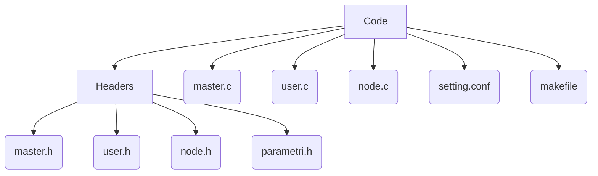

# Relazione del progetto di Sistemi Operativi
A cura degli studenti Milani Alessandro e Laudito Federica.

## struttura del progetto:
Abbiamo scelto di dividere il codice in vari file secondo le tecniche di programmazione modulare.

Esso è infatti diviso in:


Ogni file ha la sua funzione e il suo scopo per la corretta funzionalità del progetto.

## setting.conf
il file setting.conf è il file da cui recuperiamo i valori scritti in tempo d'esecuzione.

Infatti prima di eseguire il programma bisognerà:
- Da terminale, recarsi nella cartella del programma
- Eseguire il comando:
```bash
source setting.conf
```
In questo modo importiamo i valori presenti nel file come variabili d'ambiente per linux.
(Nel caso si decidesse di modificare i valori presenti nel file, sarà necessario eseguire nuovamete il comando "source").


## makefile
Digitando "make" creiamo o aggiorniamo i file oggetto dei rispettivi file di compilazione grazie al file "makefile".

## parametri.h
file Header principale, esso contiene

- la define \_GNU\_SOURCE necessaria per la compilazione tramite pedantic;

- tutte le librerie comuni ai file.c;

- le define che assumono il valore delle variabili passate in tempo di esecuzione dal file setting.conf;

- le define che assumono il valore delle variabili passate in tempo di compilazione;

- l'inizializzazione delle strutture che useremo per il progetto, si tratta di strutture annidate: la struttura del libro mastro contiene infatti la struttura dei blocchi che contiene a sua volta la struttura delle transazioni;

- l'inizializzazione del metodo one_for_all, una funzione handler che verrà poi creata e applicata nello specifico da tutti e 3 i file.c e che si occupa proprio della gestione, tramite switch case, del comportamento da far assumere al programma dopo la ricezione di vari segnali. 

## master.c
Il master.c si occupa della generazione, tramite l'utilizzo della fork, di SO_USERS_NUM processi utente e di SO_NODES_NUM processi nodo.

Esso include il file **master.h**, che contiene l'inizializzazione delle funzioni utilizzate soltanto dal master.c e che include a sua volta il file **parametri.h**.
Alla sua creazione abbiamo inizializzato delle variabili globali, variabili non globali e delle risorse ipc.

Per quanto riguarda gli array e le matrici create, abbiamo scelto, poiché erano dinamici, di applicare per ognuno di loro la malloc.

##### risorse ipc create:

- **3 memorie _condivise_**
	1. master_book:
		- Con essa noi condividiamo la struttura del libro mastro.
	1. user_alive:
		- Con user_alive abbiamo un array condiviso dai processi che contiene i Pid di tutti i processi user vivi, abbiamo fatto questa scelta implementativa a favore del fatto che questo ci permette di gestire come si deve il blocco di invio e di ricezione delle transazioni da parte o a favore dei processi utente morti.
	1. index_alive:
		- Si tratta di una memoria condivisa al cui indirizzo è presente il numero totale di utenti attualmente vivi, inizializzato pertanto a SO_USERS_NUM.
		- Abbiamo applicato questa scelta a causa del fatto che ci era impossibile utilizzare un’unica struttura che contenesse un array dinamico ed un intero che indicasse il suo indice.

- **SO_NODES_NUM code di messaggio**
	 - abbiamo scelto di fare tante code di messaggio quanti sono il numero di nodi da creare: ogni coda parte con una chiave predefinita a cui andiamo a sommare l’indice del nodo a cui deve fare riferimento. È un metodo che ci permette così di non rischiare di usare troppo spazio per un’unica coda e per poter avere più controllo sui nodi e sulla scelta casuale di essi.
	
- **2 semafori**
	1. il primo semaforo si occupa di sincronizzare la scrittura sul libro mastro da parte dei processi nodo.
	2. il secondo si occupa di sincronizzare invece la scrittura sull'array contenente i processi ancora vivi.

##### execv
Tramite la System call execv sostituiamo e passiamo vari argomenti dal processo master ai processi figli, prima i processi nodo e in seguito i processi utente.

Per farloabbiamo dovuto usare prima di tutto la seguente funzioni per tutti gli argomenti da passare tramite execv: 
```C
sprintf(/*char in cui convertire il terzo argomento*/, "%d",/*intero che vorremmo passare*/);
```


##### gestione del budget

- All'interno del libro mastro sono contenute e vengono confermate le transazioni ricevute dai processi nodo.
- Abbiamo scelto di salvare i budget dei processi nodo all'interno di un array mentre, per quanto riguarda i processi utente, abbiamo deciso di salvarli all'interno di una matrice composta da SO_USERS_NUM righe e 2 colonne.
	- Nella prima colonna vengono salvati i budget dei processi utente, mentre nella seconda vengono salvati i rispettivi Pid.
- Questi valori cambiano a seguito della ricezione di messaggio 

##### la terminazione

- Per gestire la terminazione corretta dell'esecuzione abbiamo scelto di utilizzare una variabile globale chiamata flag che, quando cambia valore perché è accaduto qualcosa che deve far terminare il tutto, permette l'uscita dal ciclo while della funzione main e ci consente, tramite uno switch case, di delineare il motivo della terminazione del programma. A seguito della stampa finale terminiamo tutti i processi ancora vivi rimasti (tramite l'invocazione del metodo **kill_process**, che si occupa di gestire l'invio, a tutti i processi non ancora terminati, del segnale che farà sì che loro terminino correttamente), deallochiamo tutte le risorse ipc create e liberiamo la memoria occupata dalle precedenti malloc eseguite.

### funzioni usate:

|     FUNZIONE     | TIPO DI RITORNO / VOID | PARAMETRI                                                                                                                                               |                                                                                     COSA FA                                                                                      |
|:----------------:|:----------------------:| ------------------------------------------------------------------------------------------------------------------------------------------------------- |:--------------------------------------------------------------------------------------------------------------------------------------------------------------------------------:|
|    node_print    |          void          | - array contenente il bilancio di tutti i processi nodo <br/><br/> - array contenente il Pid di tutti i processi nodo                                   |                                  stampa del budget sia nel corso della stampa di ogni secondo sia per la stampa di terminazione dell'esecuzione                                  |
|    user_print    |          void          | matrice contenente il bilancio degli user e il rispettivo Pid                                                                                           |                                  stampa del budget sia nel corso della stampa di ogni secondo sia per la stampa di terminazione dell'esecuzione                                  |
| double_quicksort |          void          | - matrice contenente il bilancio degli user e il rispettivo Pid<br/><br/>- intero inizializzato a 0<br/><br/>-indice dell'ultimo elemento della matrice |                                                  ordina la matrice in base al budget che i suoi elementi contengono a colonna 0                                                  |
|   kill_process   |          void          | array contenente il Pid di tutti i processi nodo<br/><br/>- matrice contenente il Pid di tutti i processi utente                                        | funzione che si occupa di gestire l'invio del segnale che notificherà a tutti i processi di terminare perché è occorso qualcosa che ha portato alla terminazione dell'esecuzione |
|   check_index    |          void          | - id del sender o del receiver<br/><br/>- matrice conenente il bilancio degli user e il rispettivo Pid                                                  |   qualora i processi utente non venissero creati con il Pid che è più grande del precedente di 1, questa funzione si occupa di fare in modo che l'indice sia comunque corretto   |


## user.c

Lo user.c è il file che viene eseguito da tutti i processi utente.

Si occupa della creazione e dell'invio delle transazioni.

Esso include il file **user.h**, che contiene l'inizializzazione delle funzioni utilizzate soltanto dallo user.c e che include a sua volta il file **parametri.h**.

Dopo la creazione delle funzioni e dopo le inizializzazioni delle varie variabili lo introduciamo all'interno di un ciclo while che continua fino a quando la flag inizializzata a 0 non cambia di valore dopo che è occorso un certo evento. In particolare la flag cambierà quando la creazione o l'invio della transazione non avranno avuto successo per SO_RETRY volte consecutive o quando riceverà segnale di stop da parte del master per lo scadere del tempo. 
L'ultimo valore dell'array, appena spostato, assumerà valore -1.

Quando invece l'utente riesce a creare con successo la transazione, allora estraiamo un processo nodo a cui mandarla, tramite rispettiva coda di messaggi. 

##### la generazione di una transazione tramite segnale

Per la generazione di una transazione tramite segnale abbiamo scelto di far mandare da un secondo terminale il seguente comando:
```
kill -SIGUSR1 valore_Pid
```
questo segnale viene recepito dal master.c che a questo punto estrarrà tra gli utenti ancora vivi il Pid di un utente a cui mandare il segnale **SIGUSR1**, che darà l'ordine al processo user corrispondente di creare una nuova transazione.


### funzioni usate:
|         FUNZIONE          | TIPO DI RITORNO / VOID | PARAMETRI                                                                                                              |                                                                                                                     COSA FA                                                                                                                     |
|:-------------------------:|:----------------------:| ---------------------------------------------------------------------------------------------------------------------- |:-----------------------------------------------------------------------------------------------------------------------------------------------------------------------------------------------------------------------------------------------:|
|       bilance_check       |          int           | -struttura del libro mastro (memoria condivisa)<br/><br/>-bilancio del processo in questione<br/><br/>-id del processo |                                               aggiorna il bilancio dell'utente scansionando le nuove transazioni e salvandosi quelle in cui lui è il receive.<br/>Ritorna il valore del bilancio.                                               |
| generatore_numeri_casuali |          int           | -minimo<br/><br/>-massimo                                                                                              |                                                                                                            genera un numero casuale                                                                                                             |
|    create_transaction     |          int           | -bilancio dell'utente<br/><br/>-id dell'utente                                                                         |                                             calcola il bilancio dell'utente e si occupa della creazione della transazione<br/>ritorna 1 se la transazione è stata creata con successo, altrimenti 1                                             |
|         send_msg          |          int           | -struttura della transazione<br/><br/>-id della coda di messaggio                                                      |                                                             invia il messaggio contenente i dati della transazione, se tutto è andato a buon fine ritorna 1, altrimenti ritorna -1                                                              |
|        remove_pid         |          void          | -Pid del processo morto<br/><br/>-memoria condivisa index_alive                                                        | decrementa il valore dell'index dell'array della memoria condivisa index_alive e sposta il valore dell'ultimo Pid presente nell'array della memoria condivisa user_alive nella posizione dove era presente il Pid del processo appena terminato |


## node.c
Il node.c è il file che viene eseguito da tutti i processi nodo. 

Si occupa della gestione dell'inserimento all'interno della transaction_pool delle transazioni ricevute e della creazione dei blocchi che verranno poi scritti nel libro mastro tramite l'utilizzo della shared memory del libro mastro e del primo semaforo descritto.

Esso include il file **node.h**, che contiene l'inizializzazione delle funzioni utilizzate soltanto dal node.c, la struttura della transaction pool e che include a sua volta il file **parametri.h**.

Come è stato per master.c e per user.c, anche node.c funziona tramite un ciclo while che continua fino a quando non cambia il valore di una variabile globale chiamata flag.

Dopo aver inizializzato tutte le variabili di interesse e creato le funzioni, entriamo infatti nella funzione main che a sua volta entra in questo ciclo while da cui uscirà quando riceverà il segnale **SIGUSR2** dal processo padre, come scritto precedentemente.


### funzioni usate

|    FUNZIONE    | TIPO DI RITORNO / VOID |                 PARAMETRI                 | COSA FA                                                                                                            |
|:--------------:|:----------------------:|:-----------------------------------------:| ------------------------------------------------------------------------------------------------------------------ |
| tr_insert_elem |          void          | -struttura transazione<br/><br/>-intero i | alloca memoria per la creazione del nuovo nodo e inserisce la nuova transazione all'interno della transaction pool |
| dealloco_lista |          void          |             transaction pool              | libera la memoria allocata per la transaction pool                                                                 | 


 
 
## problemi noti:
A fine stampa, in seguito alla terminazione della simulazione, viene stampato il numero di transazioni rimaste nella transaction pool per ogni nodo:questo numero è sempre lo stesso, ma non riusciamo a capirne il motivo.