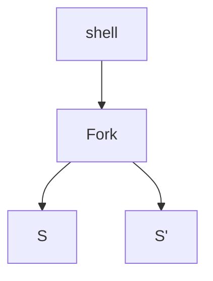
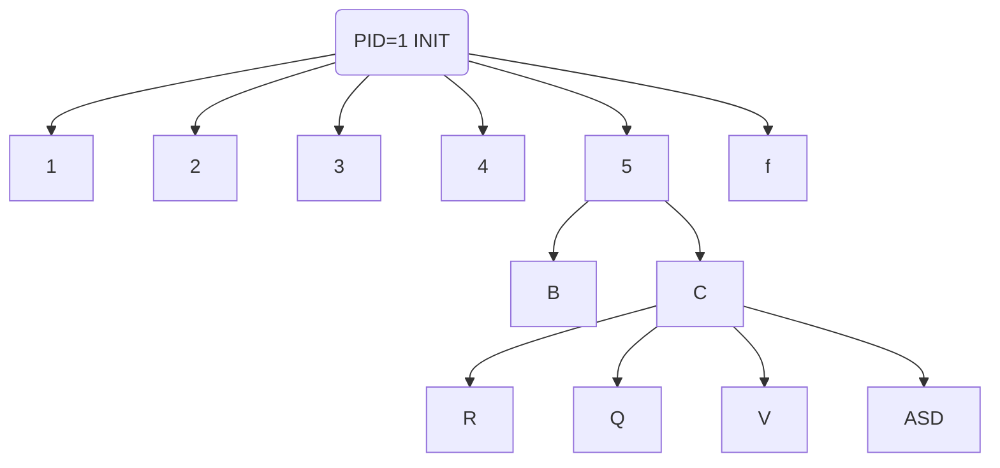

## Prelazione

Meccanismo che premette al SO di sottrarre una risorsa(cpu) a un processo(running)

#### RIassegnare la cpu a un altro processo
Avvine in 4 circostanze diverse 
1. processo running diventa waiting
2. processo running viene riportato a ready
3. processo waiting diventa ready
4. processo running termina

- caso 1 e 4 -> no prelazione -> rilascio volontario della cpu
- prelazione solo nei casi 2 (es. nel round robin) e 3

Shortest jobs first ( senza prelazione) -> presenta una variante con prelazione -> *Shortest remaining time first*

- se un nuovo processo richede poco tempo può finire in testa alla coda ready
	- se ne richiede meno di quanto ne richiederebbe quello in esecuzione per finire, lo può spostare nello stato waiting per eseguire quello nouvo più breve

- La prelazione richiede un supporto HW

---
## Processi: creazione e terminazione 
- Sappiamo come è fatto un processo(PCB, struttura dati -> esecuzione ...)
- Come si creano?
	- Un processo è creato da un altro processo
	- Alla creazione, un processo è uguale a quello che lo ha generato
		- quando premo invio per eseguire il mondando "ls" viene creato il processo ls... Come?
			- La shell ricevuto il comando, esegue una fork che genera 2 processi: uno uguale alla schell originale (S) ed un S' inizialmente identico, ma va poi ad eseguire il codice del nuovo comando (è cambiato il riferimento al programma all'interno del PCB)
				- il tutto avvieen grazie a delle syscall (tra cui EXEC)
			- Rimane una relazoine padre/figlio tra i 2 processi generati  

### Albero dei processi

- i processi che stanno più in basso muore prima del processo padre (generalmente viene creato per svolgere una funzione utile al processo padre)
- Al termine di un prcoesso, il suo PCB non viene subito eliminato, perchè mantiene un informazione sul come vine terminato (in base a ciò il processo padre può agire diversamente)

1. P produce F via Fork
2. F termina
3. P ispeziona** info sul terminazione** del processo figlio (wait) <- processo zombie
	1. se non si leggono le info, rimangono nella ram ad occupare memoria creando problemi 
4. info sulla terminazione di F vengolo raccolte

- Se termina prima il processo padre del processo figlio?
	- Procede come nulla fosse come processo orfano, e viene "adottato" dal processo con PID=1 (INIT)

## Sistema SW articolato in tanti processi

- es: P1 riceve dati dall'estenro -> li passa a P2 che esegue cose belle -> li passa a P3 che li prepara all'output
	- il vantaggio che i vari processi possono "portarsi avanti" iniziando a lavorare i dati successivi mentre altri stanno finendo con i precendenti
- il tutto si definisce pipeline
	- ci possono essere casi di processi che lavorano in parallelo, non solo in succesisone

i processi possono essere:
- Cooperanti (comunicare)
- Competitivi (competono per le risorse)

#### Processi Cooperanti
Modelli di comunicazione:
1. Modello a memorica condivisa
2. Modello a scambio di messaggi

| Soluzione Monolitica | Soluzoine a processi cooperanti |
| -------------------- | ------------------------------- |
| 1) Leggo D           | P1 Leggo D  |
| 2) passo A           | P1 Passo A  |
| 3) Passo B           | P2 passo B P1 Leggo D'|
| 4) *Ricomincia*         | *Sovrappongo l'esecuzione di B alla lettura del dato successivo*|

- **Memoria Condivisa**
	- area accessibile a diversi processi (Read/Write)

- **Scambio di Messaggi**
	- richiede un mezzo -> una coda di messaggi (apparentemente una memoria condivisa)
		- i processi non sanno come è implementata la coda di messaggi, ma sfruttano le primitive "send" "recive"  
	- Scambi Diretti/Indiretti
		- Diretti: il processo deve conoscere l'identità del processo con cui comunica( P1 per madnare messaggio a P2, deve conoscere il suo PID) send(m,P2) <--> recive(m,P1)
			- La coppia P1,P2 definisce un canale di comunicaizione
		- Indiretti: Mailbox, i mittenti possono depositarci i propri messaggi: send(m,M) -> M indentificatore mailbox
		- idem per ricevere: recive(m,M)
			- processi debolmente accoppiati -> da più robustezza al sistema (se muove un processo e viene sostituito con PID diverso, il tutto continua a funzionare) 