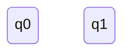
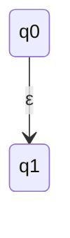
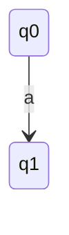

## Espressione regolare → ε-NFA 
 terorema: 
 - data sepressione regolare E, esiste un ε-NFA  A t.c. L(A)=L(E)
 
 Dimostrazione:
 - 
Costruiamo A per induzione sulla struttura diE e per casi sulla sua forma, facendo in modo che l’εNFA ottenuto abbia sempre esattamente uno stato finale

**Caso $\emptyset$ (linguaggio vuoto)**

**Caso ε (linguaggio sola stringa vuota)**

**caso a (linguaggio che contiene solo a)**

![[ArcoLinux_2021-10-06_11-31-34.jpg]]

![[ArcoLinux_2021-10-06_11-33-35.jpg]]

---
## Proprietà di chiusura dei linguaggi regolari
### Sommario
- $L \cup L^I$
- $L \cap L^I$
- $LL^I$
- $\overline L$
- $L - L^I$
- $L^R$

### Unione e concatenzazoine
- i Linguaggi sono chiusi per unione e concatenzazione

### Complemento
Sono chiusi per complemento.

**Dimostrazione**
- L linguaggio regolare
	Dunque esiste DFA A t.c. L=L(A)
	Definiamo $B=(Q,\sum,\delta,q_0,Q_F)$ e osserviamo che $w \in L(A)$ <=>$\hat\delta(q_0,w) \in F$<=>$w \nin L(B)$
	concludiamo che $\overline L=L(B)$ e che $\overline L$ è regolare
	
	### Intersezione
	Sono chiusi per intersezione
	**Dimostraizone**
	- siano L1 ed L2 linguaggi su un alfabeto $\sum$
	Usando De Morgan, osserviamo -> $L_1 \cap L_2 = \overline{\overline{L_1 \cap L_2}} = \overline{\overline L_1 \cup \overline L_2}$
	 
	 Dato che i linguaggi sono chiusi per unione e complemento, concludiamo che $L_1 \cap L_2$ è regolare
	
	### Intersezione (costruzione diretta -> da copiare)
	
	### DIffernza
	Sono chiusi per differenza
	
	** Dimostrazione**
	- Siano $L_1 ed L_2$ linguaggi su un alfabeto $\sum$
	Basta osservare che $L_1-L_2=L_1 \cap \overline L_2$ dato che i linguaggi sono chiusi rispetto intersezione ecomplemento
	
	### Inversione
	sono chiusi per l'inversione
	
	**Dismostrazione**
	- se L è regolare, deve esistere un espressione regolare E t.c. L=L(E)
	- Definiamo l'espressione regolare $E^R$ per induzione sulla struttura di E e per casi sulla sua forma, usando le seguenti equazioni: ![[ArcoLinux_2021-10-06_12-51-23.jpg]]
		è facile dimostrare che $L(E^R)=L(E)^R$ dunque $L^R$ è regolare
		