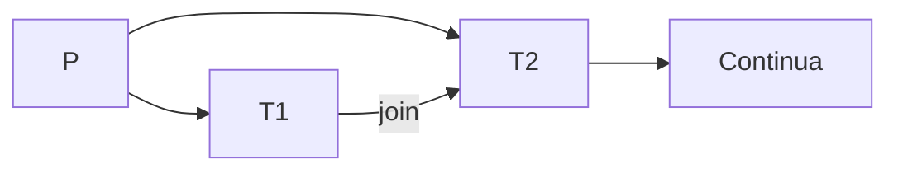

## Scambi di messaggi

### Buffer
- caratterizzato dalla capacità -> quantita di messaggi
	1. a capacità 0
		- il processo mittenete mantiene il messaggio nelle proprie strutture dati
		- il mittente rimane bloccato finch'è il ricevente non "ritira" il messaggio 
	2. a capacità limitata
	3. a capacità illimitata 

- 2 tipi di send
	- sincorna -> il mittente si sospende finchè non si libera una zona del buffer
	- asincrona -> lo mette nella mailbox e continua a fare i fatti suoi

- 2 recive
	- sincorna -> si ferma ed aspetta che arrivi un messaggio nella coda
	- asincrona -> va a cercare un messaggio - non lo trova - continua a lavorare comunque, senza fermarsi ad aspetttare
		- serve meccanismo di polling per controllare ogni tot. se c'è un messaggio ( e cosa fare nel frattempo se non lo trova) 

send + recive sincrone -> si dice "rendez-vous"

** Memoria condivisa del buffer**
send e recive nascondono una serie di meccanismi, per mantenere consistente lo stato del buffer (così i proces. non se ne devono preoccupare)

#### Implementare scambio di msg
- Socket -> sistema client (richiesta) / server (eroga un servizio)
	- 192.168.1.14:80 <- la porta è un socket (il server rimane in ascolto sulla porta)

#### Remote procedure call (RPC)

- un processo rischiede l'esecuzione di una procedura su una macchina diversa 
	- processo con istruzioni....in mezzo c'è uno RPC (STUD) -> permette di trovare la macchina remota in ascolto  e la porta -> il server esegue la procedura richiesta
	- come conosco la porta?
		- o è hard-coded (scritta direttamente nel codice), o sfrutta sistemi esterni di Match Maker per essere più flessibili

#### Pipe
Anonima o con nome
- Anonima:
	- Canale si comunicazione simplex (solo ricevente o mittente)
	- i messaggi vengono accodati e gestiti come First in first out
	- es. processo P crea pipe anonima -> crea processo figlio -> manda messaggi attraverso la pipe anonima Pipe
		- La pipe svanisce quando termina il processo creatore

---

# Thread
Simile al concetto di processo, è più vicino all'idea di un sottoprocesso
- Se devo calcolare f1 + f2, è più comodo calcoalre f1 || f2 e poi sommarle.
	- potrei generare 2 processi figli, ma è un po' troppo esagerato ata la semplicità del compito
	- Quinidi uso i threads
		- ogni treads ha un suo identificatore (TID) ed un suo stack  
		- possono eseguire solo il codice del processo
		- Hanno le variabili globali in comune

### Thread Utene e Kernel
P diviso in T1 T2 e T3
- Se eseguo una fork, non è detto che venga duplicata tutta la struttura
	- l'inverso della fork è il Join
- Se P geenra T1 e T2, posso mettereìne  1 in attesa della conclusione dell'atro (le 2 esecuzionni "convergono")  

