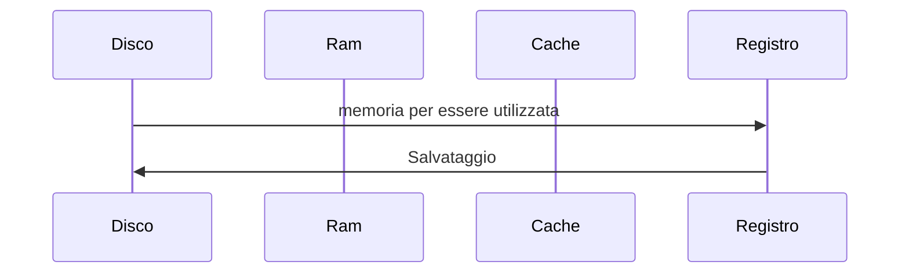
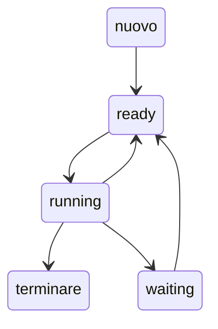

## Content switch
1. duraren l'esecuzione di un codice P, quando ci si inbatte in un evento (es. input), le info del codice venogono salvate e l'esecuizone congelate per liberare la cpu
1. così l'OS può caricare l'handler dell'evento in questino (es. ricevere il dato in input)
3. La cpu è di nuovo libera e viene riassegnata al codice dell'utente che può riprendere l'esecuzione

## Gestione Meoria
### Memoria principale -> RAM
- unica memoria di gande capacità direttamnte accessibile dalla cpu
CPU <--> RAM  $\ \ \ \ \ \ \ \ \ \ \ \ \ \ \ \  .$ DISCO -> il suo contenuto deve essere trasferito sulla ram per essere sfruttato 

- il processo di salvataggio può fermarsi ala RAM se non serve salvare il dato permanentemente

## Device / Dispositivi
- tutto ciò che non è cpu o memoria
- la comunicazione dipende da:
	- HW -> Controller
		- può essere visto un mini (molto mini) pc all'interno del device 
	- SW -> Driver di dispositivo 
	
## Altro sulla cpu
-  Per il corso partiamo dall'idea che le CPU siano single core (per evidenziare meglio i "problemi")
	- tutti i processi sono eseguiti in parallelismo virtuale  
-  Con un architettura multi core posso avere del parallelismo reale
	- hanno un collo di bottiglia con l'accesso alla memoria
		- se serve eseguire 3 read sulla setessa memoria, vengono messe in coda

## Creazione SO
 So:
 - sw che manipola strutture dati
 - strutture dati rappresentano dell'informazione

Serve identificare le giuste **astrazioni** per ogni elemento da gestire

#### Processi
- Bisognsa dare una rappresentazione ai processi
	- gli si da un identificatore
	-  un riferimento al codice
	-  un riferimento allo stack
- il SO ha bisogno di poter assegnare della memoria Ram ai processi
	- ed impedire aventuali interferenze

--------------
Torniamo alla Cpu

- Ogni cpu ha il proprio Instrution set
- esegue sia processi utente che processi di Sistema Operativo
	- i P. utenti possono usare tutto Instruction set o deve avere dei limiti? 
		- servono dei limiti, in quanto potrebbero interferire con altri processi / alterare dati di sistema
	- Si sfrutta la Dual Mode
		- si ha una parte dele istruzioni eseguibile da tutti i processi
		- ed una eseguibile solo dal sisema operativo  
			- L'architettura fornisce il Bit di modalità
				- 1 = modalità utente
				- 0 = modalità Kernel (SO)
			- è possibile passare alla modalità kernel solo tramite una System Call    

(Modalità copiare da Fabio)

## System Call
1. controllo dei processi
	1. chiusura dei processi kill()
	2. processi generati da processi fork()
2. gestione dei file
	1.  creare 
	2.  cancellare
	3.  lettura
	4.  scrittura
3. gestione dei device
4. gestione delle informazioni
5. comunicazione

## Cilco di vita di un processo
### Diagramma di transizione di stato dei processi
