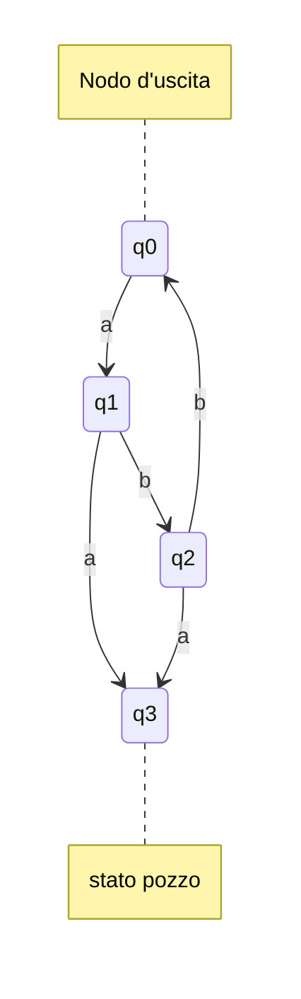
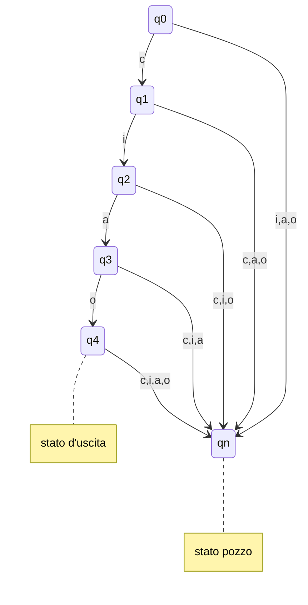
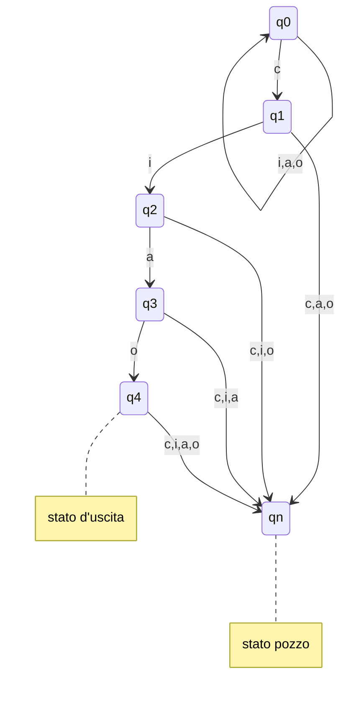
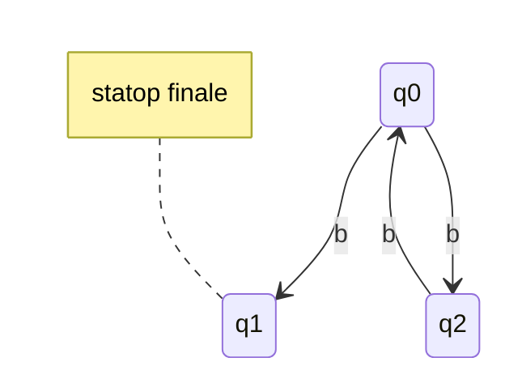

### Esempio, ogni a seguita da bb

## Progettare automa che riconosce una sola stringa

- inizio a scrivere le transizioni per riconoscere **SOLO** una stringa
	- es. riconoscere Ciao  c-->i-->a-->o 
- aggiungo stato pozzo nel caso l'auto "perda le speranze"
	- es. se prima lettera diversa da c (o seguita da letera inaspettata)
	- es. lettere dopo la "o" (es. ciaoc / ciaoo)

---
### Variante

- Riconosce tutte le stringhe che finiscono con "ciao" ed iniziano con una qualsiasi combinazione di "i,a,o"

## Automa non deterministico
Automa che può "scegliere" transizioni diverse a partire dallo stesso stato corrente e porssimio simbolo della stringa da riconoscere
$$ \delta : Q × \sum → \wp(Q) $$

### Esempio
Riconoscere biglie se pari o dispari (dicendo solo si o no)
 - Ma non c'è la lampada

 **Osservazione**
- per ogni n >= 2, il numero *n-2* è pari se e solo se *n* è pari 
- per ogni n >= 2, il numero *n-2* è dispari se e solo se *n* è dispari 

**Soluzione**
mi comporto diversamente in base a quante biglie vedo nel recipiente:
- se il recipiente è vuoto dico "no" 
- se una solo dico "si" 
- se 2 o pùi, rimuovo 2 biglie e ricontrollo 

q0 = guardo reciepente, se vuoto dico "no"
q1 = il recipiente conteneva  1 sola biglia, dico "SI"
q vvvvvfff2 = ii recipiente conteneva 2+ biglie, ne ho rimossa 1, tolgo l'altra tornano a q0

## Definizione
Un automa a stati finiti non deterministici (detto NFA) è una quintupla $A = (Q, \sum, \delta, q_0,F)$
- Q insieme finito si stati
- $\sum$ **alfabeto** dell'automa
- $\delta : Q \ x \ \sum→ \wp(Q)$ f**unzione di transizione**
- $q0 \in Q$ **stato iniziale**
- $F \subseteq Q$  insieme di stati finiti

### Note (da copiare)
- $\delta(q,a)$
- $\delta(q,a)$
- $\delta(q,a)$

### Linguaggio riconosciuto da un FNA
la fuzione di tranaizione estesa dell'NFA $A = (Q, \sum, \delta, q_0,F)$ è la funzione $\^{\delta} : Q \ x \sum^* -> \wp(Q)$ definita per induzione sul suo seconod argomento come segue:
$$\^{\delta} (q,\epsilon)=\{q\} \ \ \ \ \ \ \ \ \ \ \  \ \ \ \ \ \ \ \ \ \ \ \ \ \ \ \ \^{\delta} (q,wa) = \{r \in \delta(p,a) | p \in \^\delta(q,w)\}$$

#### Definizione
Il linguagguio riconosciuto dall'NFA e denotato da L(A) e definito come:
$$ L(A) = \{w \in \sum^* | \^\delta(q_0,w) \cap F \neq \emptyset \}$$
##### Nota
- l'NFA rioconosce una stringa w se esiste un percorso etichettato con w che lo porta dallo stato iniziale $q_0$ a uno dei suoi stati finali F
##### Rappresentaizone Tabellare
|Stato|b|
|---|---|
|-> $q_0$|{$q_1,q_2$}|
|q1|$\emptyset$|
|q2|{$q_0$}|

### DFA --> NFA  //Finire di copiare
**Teorema**
dato DFA *D*, ssite NFA* N* t.c. L(N)=L(D)
- **Dimostrazione**
	- definiamo N = $(Q, \sum, \delta_N, q_0,F)$ dove
	- $$\delta_n(q,a)=\{(\delta_D(q,a)\}$$ 

### NFA --> DFA
L(D)=L(N)

#### Intuizione
- creiamo DFA son stati = insime di stati dell'NFA
- DFA traccia tutti gli stati in cui NFA si può trovare durante la lettura della stringa
- siccome NFA ha un n finito di stati, lo sono anche quell idi DFA (al massimo $2^n$)

#### Conseguenze //Finire di copiare

## NFA --> DFA: costruzione sottoinsiemi
- fare tutto per bene dopo lezione (dare un occhiata libro)