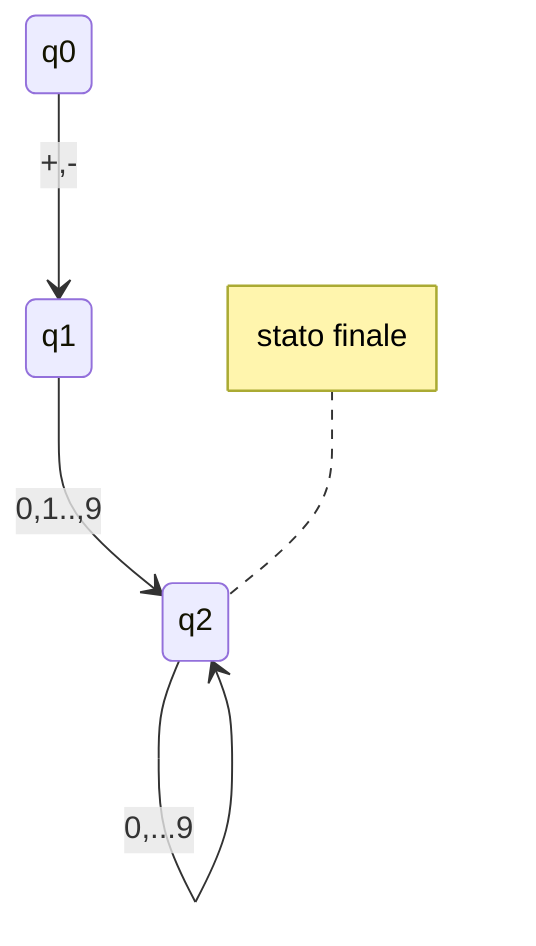
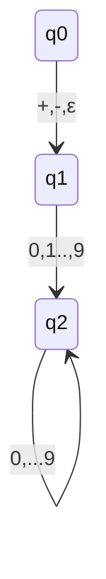

## Esercizio Ogni a seguita da bb
- tabella automa deterministico

|.|a|b|
|:---:|:---:|:---:|
|->\*{q0}|{q1}|{q2}|
|{q1}| $\emptyset$|{q2} |
|{q2}|$\emptyset$|{q0}|
|$\emptyset$|$\emptyset$|$\emptyset$|
![[Pasted image 20210929113419.png]] 
# **convertire foto in schemi**

---

## Automi con $\epsilon$- transizioni
Automi che possono eseguire transizioni sponatee senza leggere alcun simbolo nella stringa da riconoscere
$$\delta:Q\ x\ (\sum \cup \{\epsilon \} \ \ -> \wp(Q)$$

#### esempio: costanti numeriche con segno 

- questo automa si aspetti che l'automa inizi con un segno 
- Se voglio che riconosca anche costati senza sengo, devo aggiungere 10 transizioni da q0 a q2 (uno per cifra 0...9)
	- oppure aggiungo una transizione spontanea da q0 a q1 $\epsilon$, e poi il riconoscimento delle cifre parte da q1.

## $\epsilon$-chiusura
### intuizione
per definire il linguaggio riconosciutio da un $\epsilon$-NFA, è impostare riuscire a determinare quali statisono raggiungibili grazie alle $\epsilon$-transizioni

### Definizione
ECLOSE(q) è il più picoclo insieme t.c.
- q $\in$ ECLOSE(q)
- se p $\in$ ECLOSE(q), allora $\delta(p,\epsilon) ⊆ ENCLOSE(q)$

Quindi, se S è un insieme dio stati, definiamo ECLOSE(S) = $\bigcup_{q \in S}ECLOSE(q)$

-- Esempio $\epsilon$-chiusura da copiare

## Linguaggio riconoscituo da $\epsilon$-NFA
### Definizione
La funizone di transizione estesa dall $\epsilon$-NFA $A=(Q, \sum,q_o,F)$ è lda
... copiare

---

## NFA --> $\epsilon$-NFA
### Teorema
Dato un NFA N, esiste un $\epsilon$-NFA E, t.c. L(E) = L(N)

### Conseguenze
- ogni linguaggio 

# recuperare slide DIO CAN