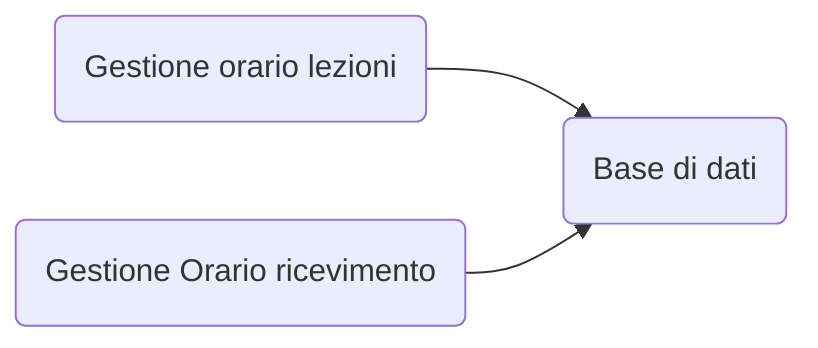

## Contesto arogmenti del corso: Sistema infomatico di un organizzazione
Componente di un organizzazine che gestisce (acquisisce, elabora, consera, produce) le informazioni di interesse di un organizzazione
*Il sistema informativo non è detto che sia completmaente informatizato (può essere un libro mastro, insime edi fogli o altro)*

### Sistema informatico
- Porzione automatizzata del sistema informativo (si avvale di HW e Software)

## Gestione delle informazioni
1. Raccolta, aquisizione
2. Archiviazione, conservazione
3. Elaborazione, transformazoine, produzione
4. Distribuzione, comunicazione, scambio

## Informazioni e Dati
- I dati sono la rappresentaizone essenziale/spartana dei dati
	- Diventano informazioni solo se **interpretati e correlati tra loro nel giusto contesto** 

# Basi di dati
- #### Definizione generica/metodologica
	- Insime organizzato di dati utilizzati per il supporto allo svolgimento delle attività di un ente 
	- Una base di dati è:
		- Un **insieme di dati atomici** strutturati e persistenti
		- Raggruppati in **insiemei omogenei** in relazione tra loro
		- Organizzati con la **minima ridondanza** 
		- **Utilizzati** da applicazioni diverse (o più utenti sulla stessa applicazione) in modo **sicuro e controllato**
- #### Definizione specifica/metodologica/tecnologica
	- Insime di dati gestito da un DBMS

- ### Sono condivise
	 - Ogni organizzazione è divisa in settori 
		 - Ciascun settore ha un suo (sotto)sistema informativo
			 - Alcuni dati possono essere comuni tra più sotto-sistemi, altri esclusivi di un settore ed il suo sistema

### Archivi VS basi di dati

##### Ignorando i concetti di basi di dati

Problemi:
- Ridondanza
- Rischio incoerenza

##### implementando le basi di dati

La base di dati è condivisa fra le applicaiozioni con delle conseguenze:
- Attività svolte da soggetti con diverse autorizzazioni
	- (Serve meccanismo per gestire le autorizzazioni)
- Accessi da parte di più soggetti ai dati condivisi:
	- Controllo della concorrenza 

### Sviluppo basato su archivi indipendenti 
Facile da implementare all'inizio, **ma** si raggiunge rapidamente al collasso del ssitema informatico (e quindi di quello informativo)
- Ogni volta che aggiungo qualcosa, devo controllare tutte le applciazioni precendenti (difficoltà quadratica -> alla n applicaizone crata, ne devo controllare n-1)

**Criticità**:
- Eterogeneità dei sistemi
- Difficoltà interscambio dei dati
- Ridondanza e incoerenza
- Assenza viisione unitaria

### Sviluppo integrato
1. Data la struttura orgnaizzativa, si esegue un analisi esaustiva del ssitema informativo (indipendentemente dalle applicazioni)
2. Definiti lo schema, i dati e le informazioni di interesse, si sviluppa l'applicazione
3. L'applicazione si interfaccerà con il DBMS in base alle sue esegenze
$$PRIMA\ I\ DATI,\ POI\ LE\ APPLICAZIONI$$
![[Pasted image 20220228104836.png]]

# Data Base Managment Ssytem (DBMS)
Sistema centralizzato o distribuito che consente di:
- Definire schedi di basi di dati
- Specificare i vincoli di integrità dei dati
- Scegliere le strutture dati per la memorizazione e l'accesso ai dati
- Memorizzare, recueprare e modificare (da shell o programim) i dati da utenti autorizzati

## Architettura standard (ANSI/SPARC) a tre livelli per DBSM
Utenti -> (indipendenza logica)-> schema esterno ->(indipendenza fisica)-> schema logico -> shema interno -> BD
**Schema Logico**
- Ne risiede la descizione formale dell'intero patrimonio informativo della realtà rappresentata
**Schama Interno**
- Definisce come sono memorizzati fisicamente i dati all'interno del DBMS
**Indipendenza fisica**
- I programmi applicativi devono rimanere logicamente inalterate a fronte di eventuali modifiche delle strutture di memorizzazione dei dati o delle vie di accesso (in parle povere:)
	- I programmi che si appoggiano al DB possono ignorare come sono memorizzati i dati
**Schema esterno**
E' la porzione di schema logico visibile alla singola applicazione

## Modelli logici
**Modello dei dati**: insieme di meccanismi di astrazione che permettono di definire una base di dati, con associato un insieme predefinito di operati e di vincoli d'integrità
- Il modello è *l'intermediario* che permette di cogliere e rappresentare la realtà
- Esempi: relazionale, reticolare, gerarchico, a oggetti, modelli, NoSQL(chiave-valore, a grafo, document-oriented, tabulare)

![[Pasted image 20220228105545.png]]

## Modelli concetturali
Permettono di rappresentare i dati in modo indipendente da ogni sistema
- Cercano di descrivere i contetti del mondo reale
- Sono utilizzati nelle fasi preliminari di progettazione
- Il più diffuso è il modello Entity-Relationship (ER)