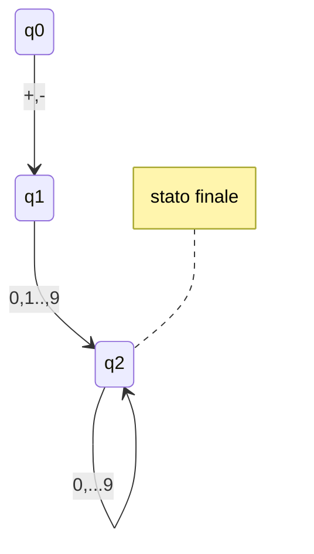
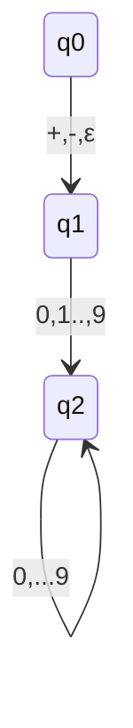
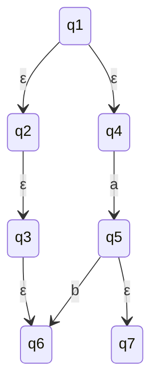

## Automi con $\epsilon$- transizioni
Un automa a stati finiti con ε-transizioni (detto anche ε-NFA) è una quintupla: $A=(Q, \sum,\delta,q_0,F)$ dove:
- Q insime finito di stati
- $\sum$ e l'alfabeto riconosciuto dall'automa
- $\delta:Q\ x\ (\sum \cup \{\epsilon \}$ -> $\wp(Q)$ è la **Funzione di transizione**
- $q_0 \in Q$ è lo stato iniziale
- $F ⊆ Q$ è l'insieme di stati finiti

#### Note:
- $\delta(q,a)$ è l'insieme degli stati in cui $\epsilon$-NFA può transitare quando si trova nello stato $q$ leggendo il simbolo $a$
- $\delta(q,a)$ è l'insieme degli stati in cui $\epsilon$-NFA può **transire spontaneamente** quando si trova nello stato q, senza leggere alcun simbolo

#### esempio: costanti numeriche con segno 

- questo automa si aspetta che la stringa inizi con un segno 
- Se voglio che riconosca anche costati senza sengo, devo aggiungere 10 transizioni da q0 a q2 (uno per cifra 0...9)
	- oppure aggiungo una transizione spontanea da q0 a q1 $\epsilon$, e poi il riconoscimento delle cifre parte da q1.

## $\epsilon$-chiusura
### intuizione
per definire il linguaggio riconosciutio da un $\epsilon$-NFA, è importante riuscire a determinare quali statisono raggiungibili grazie alle $\epsilon$-transizioni

### Definizione
ECLOSE(q) è il più piccolo insieme t.c.
- q $\in$ ECLOSE(q)
- se p $\in$ ECLOSE(q), allora $\delta(p,\epsilon) ⊆ ENCLOSE(q)$

Quindi, se S è un insieme di stati, definiamo ECLOSE(S) = $\bigcup_{q \in S}ECLOSE(q)$

### Esempio 

## Linguaggio riconoscituo da $\epsilon$-NFA
### Definizione
- La funizone di transizione estesa dall $\epsilon$-NFA $A=(Q, \sum,q_o,F)$ è la funzione $\hat\delta:Qx\sum^*$->$\wp(Q)$ definita per induzione sul suo secondo argomento:
$$\hat\epsilon: Qx\sum^* -> \wp(Q)  \ \ \ \ \ \ \ \ \hat\delta(q,wa)=\{r \in ECLOSE(\delta(q,a)) | p \in \hat\delta(q,w)\}$$

- Il **Linguaggio riconosciuto dall'$\epsilon$-NFA è denotata da L(A) e definito come segue:

   $$L(A) = \{w \in \sum^* | \hat\delta(q_0,w)\cap F\neq \emptyset\}$$

## NFA --> $\epsilon$-NFA
### Teorema
Dato un NFA N, esiste un $\epsilon$-NFA E, t.c. L(E) = L(N)

### Dim.
Basta osservare che un NFA è un caso particolare di un $\epsilon$-NFA

#### Conseguenze
- Ogni linguaggio regolare è riconoscouto da un $\epsilon$-NFA
- gli $\epsilon$-NFA hanno potere riconoscitivo almeno pari a quello dei DFA/NFA equivalenti

## $\epsilon$-NFA -> DFA
Dato un $\epsilon$-NFA E, esiste un DFA D tale che L(D)=L(E)

### Intuizione
- usiamo la costruzione per sottoinsiemi come nel caso NFA → DFA
- occorre fare attenzione agli stati raggiungibili da ε-transizioni 
- possiamo usare la nozione di ε-chiusura!

### Conseguenze
- ogni linguaggio riconosciuto da un ε-NFA è **regolare** 
- commbinando questo risultato e quello della , concludiamo che ε-NFA, NFA e DFA hanno lo **stesso potere riconoscitivo**

## ε-NFA → DFA: costruzione per sottoinsiemi
Dato un  ε-NFA, definiamo $D=(Q_D,\sum,\delta_D,ECLOSE(q_0),F_D)$ dove:
- $Q_D=\wp(Q_E)$ è l'insieme di sottoinsiemi di $Q_E$
- per ogni $S ⊆ Q_E$ e ogni $a \in \sum$ definiamo $\delta_D(S,a) = \bigcup_{qw \in S}ECLOSE(\delta_E(q,a))
- $F_D = \{S ⊆ Q_E | S \cap F_E \neq \emptyset\}$

Se si dimostra l'equazione
$$ \hat\delta_E(q_0,w)=\hat\delta_D(ECLOSE(q_0),w)$$
Si può concludere che 
$$ w \in L(E) <=> \hat\delta_E(q_0,w) \cap F_E \neq \emptyset \ \ \ \ \ \ \ \ def. di L(E)$$
$$<=>\hat\delta_D(ECLOSE(q_0),w) \cap F_E \neq \emptyset \ \ \ \ \ \ \ \ equazione \ di \ sopra$$
$$<=>\hat\delta_D(ECLOSE(q_0),w) \in F_D\ \ \ \ \ \ \ \ def. di \ \ F(D)$$
$$ <=> w \in L(D) \ \ \ \ \ \ \ \ def. di \ \ L(D)$$

## Esempio: costruzione modulare di Automi
#### Teorema
I linguaggi regolari sono Chiusi ripetto l'operazione di unione
#### Dimostrazione
se L1 ed L2 sono regolari, esistono 2 automi a stati finiti A1 e A2 t.c. $L_1 = L(A_1)\ e\ L_2=L(A_2)$. Supponiamo $A_1=(Q,\sum,\delta_1,q_1,F_1)$ e $A_2=(Q_2,\sum,\delta_2,q_2,F_2)$

Costruiamo $A=(Q_1 \cup Q_2 \cup \{q_0\}, \sum, \delta, q_0,F_1 \cup F_2)$ dove:
![[Pasted image 20211005092911.png]]

[[05. Espressioni Regolari]]