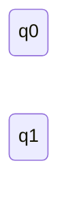
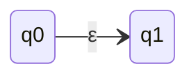

## Sintassi delle espressioni regolari
Sono definite induttivamente come segue:
- $\emptyset$ ed $\epsilon$ sono espressioni regolari
- se $a \in \sum$, allora a è un'respressione regolare
- se E ed F sono espressioni regolati, allora E+F ed EF sono espressioni regolari
- se E è un'espressione regolare, allora E* è un'espressoine regolare

#### Convenzioni
- Predecenza degli operatori + < concatenazione < \*
- Usiamo le parentesi per disambiguare la struttura di un'espressione regolare

### Significato di un espressione regolare
Se E è un'espressione regolare, il linguaggio generato da E, denotato da L(E), è definito per induzione sulla struttura di E come segue:
$$L(\emptyset) = \emptyset \ \ Linguaggio\ vuoto$$ 
$$L(\epsilon) = \{\epsilon\} \ \ \ Stringa \ vuota$$
$$L(a) = \{a\}\ \ \ Simbolo\ dell'alfabeto$$
$$L(E+F) = L(E) \cup L(F)\ \ Unione$$
$$L(EF) = L(E)L(F)\ \ Concatenazione$$
$$L(E^*) = L(E)^* \ \ Chiusura \ di \ Kleene$$

Diciamo che E ed F sono equivalenti, notazione E=F se L(E)=L(F) <- generano lo stesso linguaggio 

### Proprietà delle espressioni regolari
#### Unione  
- commutatività:  $E+F=F+E$
- associatività:  $E*(F+G)=(E+F)+G$
- idempotenza:  $E+E=E$
- identità:  $E+\emptyset=\emptyset+E=E$
#### Concatenazione  
- associatività:  $E(FG)=(EF)G$
- identità:  $E\epsilon=\epsilonE=E$
- assorbimento:  $E\emptyset=\emptysetE=\emptyset$
- distributività sinistra della concatenazione sull’unione:  $E(F+G)=EF+EG$
- distributività destra della concatenazione sull’unione:  $(E+F)G=EG+FG$
#### Chiusura di Kleene  
- idempotenza:  $(E^*)^*=E^*$
- casi banali:$\epsilon^*=\emptyset*=\epsilon$

## Espressione regolare → ε-NFA 
 terorema: 
 - data sepressione regolare E, esiste un ε-NFA  A t.c. L(A)=L(E)
 
 Dimostrazione:
 - 
Costruiamo A per induzione sulla struttura diE e per casi sulla sua forma, facendo in modo che l’εNFA ottenuto abbia sempre esattamente uno stato finale

**Caso $\emptyset$ (linguaggio vuoto)**

**Caso ε (linguaggio sola stringa vuota)**

**caso a (linguaggio che contiene solo a)**

![[ArcoLinux_2021-10-06_11-31-34.jpg]]

![[ArcoLinux_2021-10-06_11-33-35.jpg]]

 [[06. Prop. Chiusura ling. regolari]]