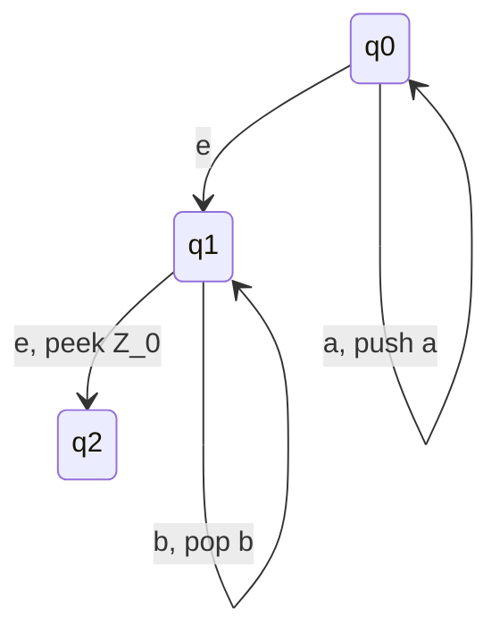
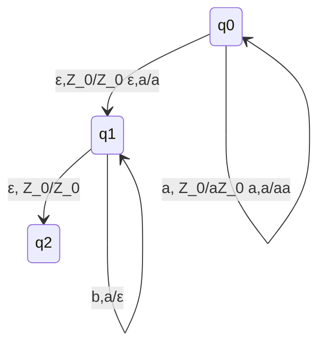

## Automi a pila

###  Esempio informale

**Inizializzazione**
La pila contiene il solo elemento $Z_0$ usato come "sentinella" (la pila finisce qui)

**Stato $q_0$: conteggio a**
- Accumulo le a sulla pila
- L'automa può "scommettere" di avere letto tutte le a e passa a $q_1$

**stato $q_1$: conteggio b**
- L'automa controlla che per ogni b, ci sia una a sulla pila, e la rimuove
- Se vede $Z_0$ sulla pila, vuol dire che ha raggiunto la fine e deve passare a q2

**Stato $q_2$: accettazione**

### Definizione
Un automa a pila (PDA) è una settupla $A = (Q,\sum,\Gamma,\delta,q_0,Z_0,F)$ dove:
- Q è insieme finito di stati
- $\sum$ è l'alfabeto d'input
- $\Gamma$ è l'alfabeto della pila (simboli memorizzati)
- $\delta: Q x (\sum \cup \{\epsilon\}x\Gamma)$ -> $\wp(Qx\Gamma^*)$ è la funzione di transizione
- $q_0 \in Q$ è lo stato iniziale
- $Z_0 \in \Gamma$ è il simbolo iniziale presente nella pila
- $F ⊆ Q$ è l'insieme di stati finiti

**Interpretazione di $(p,\gamma) \in \delta(q,\alpha,Z)$**
Quando l'automa si trova nello stato q e il simbolo in cima alla pila è Z

#### Esempio: riconoscimento stringhe $a^nb^n$

- a, $Z_0$/$aZ_0$ -> se il prossimo elemento è a, e nella pila ho $Z_0$, posso sostituire $Z_0$ con a$Z_0$ (è un push di a in cima alla pila)
- a,a/aa -> ragionamento simile, se vedo a in cima alla pila e ne pusho un altra, ottengo aa
- :ε,$Z_0$/$Z_0$ ε,a/a -> transizioni spontanee 
	- se simbolo in cima alla pila = $Z_0$, lo rimpiazzo con $Z_0$... (praticamente la lascio invariata)
	-  se simbolo in cima alla pila = a, lo rimpiazzo con a... (praticamente la lascio invariata)

## Descrizioni istantanee

### Definizione
Dato un automa a pila $P = (Q, \sum,\Gamma,\delta,q_0.Z_0,F)$, una descrizione istantanea di P è una tripla $(q,w,\alpha)$ di cui:
- $q \in Q$ è lo stato in cui si trova l'automa
- $w \in \sum^*$ è ciò che rimane da riconoscere della stringa d'input
- $\alpha \in \Gamma^*$ è il contenuto della pila dalla cima (sinistra di $\alpha$) al fondo (destra di $\alpha$)

#### Istruzione
La descrizione istantanea specifica completamente la configurazione di un automa a pila durante il riconoscimento di una stringa
- Se analizziamo l'automa all'inizio, abbiamo come tripla:
	- $q_0$ -> stato iniziale
	- $w$ -> all'inizio è tutta la stringa
	- $Z_0$ -> pila vuota

## Mosse di un automa a pila
### Definizione
Definiamo la relazione |-$_p$ come segue:
$(q,aw,X\beta)$ |-$_p$ $(p,q,\alpha\beta)$ se $(p,\alpha) \in \delta(q,a,X)$
$(q,w,X\beta$) |-$_p$ $(p,q,\alpha\beta)$ se $(p,\alpha) \in \delta(q,\epsilon,X)$
e diciamo che P fa una **mossa** da I a J (I,J -> descrizioni istantanee) se I |-$_p$ J

Scriviamo |-$_p^*$ per la chiusura riflessiva e transitiva di |-$_p$. Ovvero |-$_p^*$ è la relazione t.c.
- $I$ |-$_p^*$ $I$
- Se $I$ |-$_p$ $K$ e $K$ |-$_p^*$ $J$, allora $I$ |-$_p^*$ $J$
(Può passare da I a J in un numero impreciso di mosse, da 0 a n.)
### Convenzione
Scriviamo semplicemente |- e |-$^*$ laddove l'automa P di riferimento è chiaro dal contesto

## Linguaggio accettato da un automa a pila
Dato P, il **linguaggio accettato da P per stato finale** è:
$$L(P)=^{def}\{w \in \sum* | (q_0,w,Z_0) |-_p^*(q,\epsilon,\alpha),q\in  F\}$$
Mentre il **linguaggio accettato da P epr pila vuota**:
$$N(P)=^{def}\{w \in \sum^* | (q_0,w,Z_0) |-_p^* (q,\epsilon,\epsilon)\}$$
##### Note
- Nell'accettazione dello stato finale, il cuntenuto della pila nella D.I. finale è irrilevante
- nell'accentazione per pila vuota, lo stato della D.I. finale può non essere finale
- in entrambi i casi, la stringa d'input deve essere **consumata completamente**

###### Riconoscitore di stringhe ww$^R$
![[Screenshot_2021-11-02-10-00-19_1920x1080.png]]

[[13. Relazione CFG-PDA]]