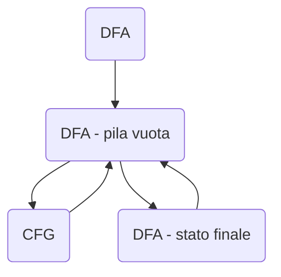

## Relazione tra CFG e PDA
- definiamo una variante deterministica dei PDA
- mostriamo che i PDA deterministici sono in grado di riconoscere tutti i linguaggi regolati e un sottoinsieme dei linguaggi liberi non inerentemente ambigui

#### Teorema
1. per ogni CFG G, esiste un PDA P, t.c. N(P)=(G)
1. per ogni PDA P, esiste una CFG G t.c. L(G) = N(P)

**INTUIZIONE PER 1.**
Data G, definiamo una PDA che simuli le derivazioni a sinistra di G. Sia P il PDA ({q},T,V $\cup$ T, $\delta$,q,S,0) dove $\delta$ è definita come segue:

$$\delta(q,\epsilon,A) = \{(q.\beta)|A -> \beta \in Q\} \ \ \ \ per\ \ ogni\ \ A \in V$$
$$\delta(q,a,a) = \{(q,\epsilon)\}\ \ \ \ \ per\ ogni\ a \in T$$
per concludere la dimostrazione è sufficiente mostrare che 
$$\alpha =>_{lm}^*\ w <=> (q,w,\alpha) |-^*(q,\epsilon,\epsilon)$$
In quanto, come caso particolare.avremo
G genera su w <=> S =>$^*$ w <=>(q,w,S) |-$^*$(q,$\epsilon$,$\epsilon$)<=>P accetta w per pila vuota

**OSS**
Riprendendo la funzione di transizione sopra definita.
 - Un PDF che riconosce il linguaggio generato da una CFG, fa uso chiave del** non determinismo** per “indovinare” la produzione giusta da usare per riscrivere una variabile $A$
 - I risultati di equivalenza tra PDA e CFG hanno una valenza principalmente teorica
 - Consideriamo i PDA **deterministici**

### Automi a pila deterministici
**Intuizione**
Non devono esserci scelte possibili a partire dalla stessa D.I.

**Def**
Un automa a pila deterministico è un PDA $P = (Q, \sum, \Gamma, \delta, q_0,Z_0,F)$ in cui ogni $q \in Q, a \in \sum, X \in \Gamma$, l'insieme $\delta(q,a,X) \cup \delta(q,\epsilon,X)$ contiene  al massimo un elemento.

#### DPDA e grammatiche ambigue
**Teoremi**
- Ogni linguaggio regolare è riconosciuto da un DPDA.
- Per ogni DPDA $P$, esiste una grammatica libera, non ambigua G t.c. L(G)=N(P)
**Dimostrazione**

[[14. Pumpling Lemma - Linguaggi Liberi]]