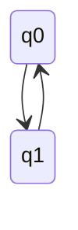
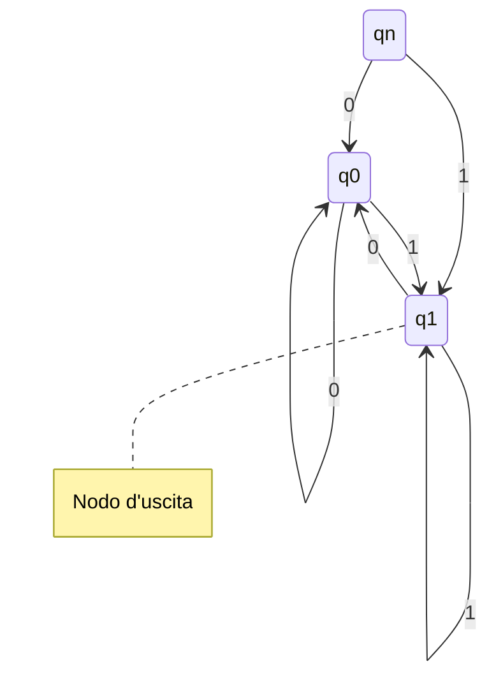
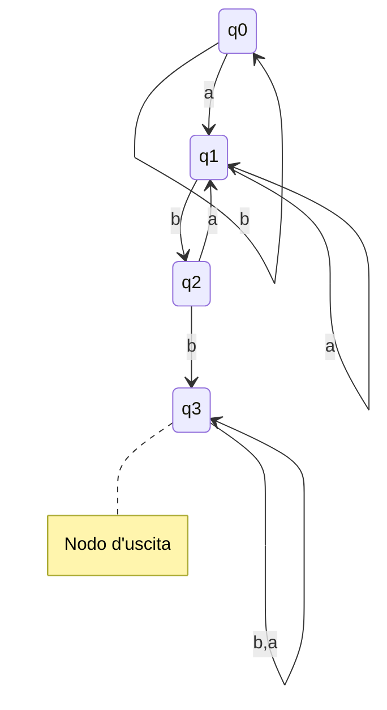
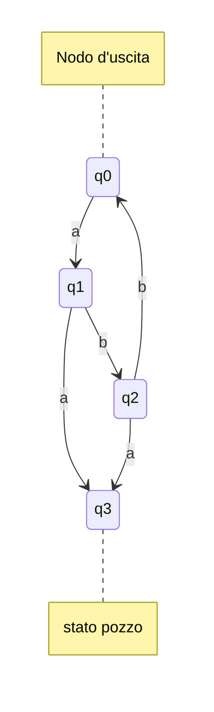
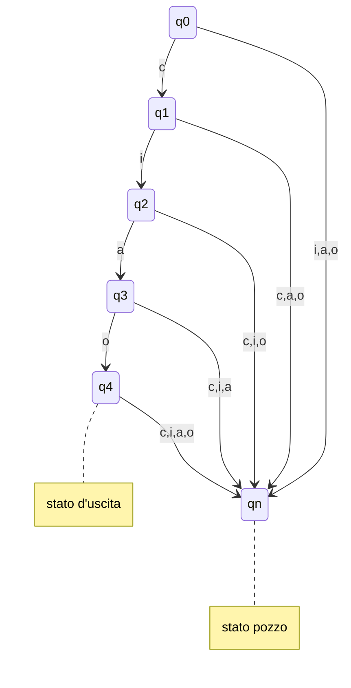
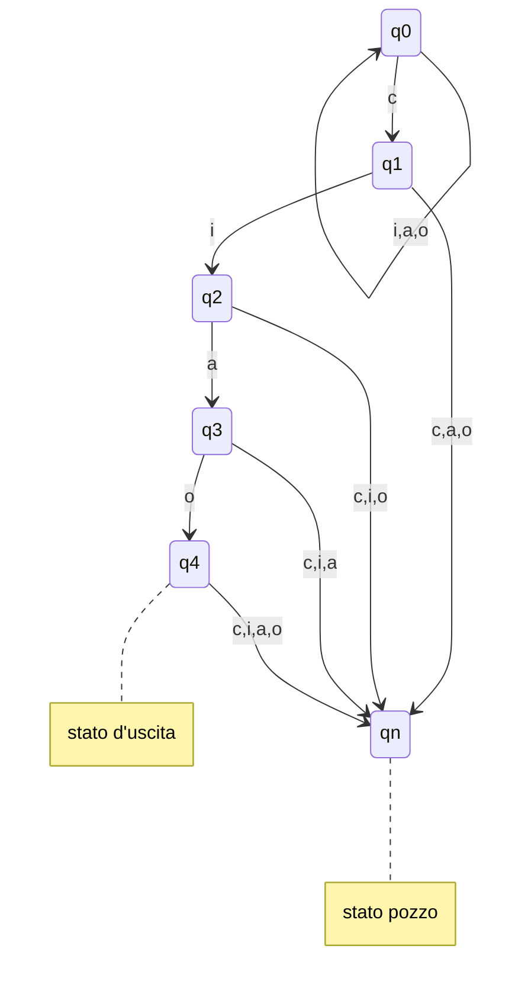

# Automi a stati finiti deterministici (DFA)
	
## Analisi lessicale
- Ricnoscere **sequenze di caraterei** che rappresentatno elementi atomici del programma
	- tali sequenze di caratteri sono dette **Token** o **lessemi** 

Prog come sequenza di caratteri -> Analizzatore lessicale (lexer) -> prog come sequenza di token

### token
- **Costate numerica intera**
	- sequezna non vuota ci di cifre decimale (eventualmente preceduta da + o -)
		- 0
		- -42
- **Costate numerica con virgola**
	- due sequenze di cirfre decimali (di cui almeno 1 non vuota), seoarate da .
		- 0.5
		- .5     
- **identificatore**
	- sequena non vuota di lettere,numeri e _ che non inizia per un numero e contiene alemno 1 carattere  $\neq$ da _
		- _4a
		- as3

## Automa a stati finiti
Cos'è?
- automa = macchina che riconosce stringhe
- stati finiti = con *memoria finita* (richiedere "poche" cose dalla stringa)
- input dell'automa = una stringa
- output dell'automa = **si/no** se ricnosce o meno la stringa

### Come funziona
- legge la tringa **un simbolo alla volta** da sinistra verso destra
	- Ha una visione locale e limitata
- ogni carattere letto altera lo stato dell'automa
	- l'automa "ricorda"    le caratteristiche della stringa letta usando lo stato
- quando la stringa è stata letta completamente rispone si/no se è sata riconosciuta o mneo

### Soluzione come automa a sati finiti
(slide)

- ogni cerchio rapprenset auno stato dell'automa
- gli archietti "b" rappresentano la transizione di stato, ovvero come cambia lo stato dell'automa a ogni estrazione di biglia
- la freccia entrante di $q_0$ indica che ...

#### Definizione
- Un **Automa a stati finiti** (DFA) è una quintupla $A=(Q,\sum,\delta,q_0,F)$
	- Q è un insieme **finito di stati**
	- $\sum$ è l'**alfabeto** riconosciuto dell'automa
	- $\delta:Qx\sum -> Q$ è la **fuzione di transizione**
	- $q_0 \in Q$ e lo **stato iniziale**
	- $F \subseteq Q$ è l'iniseme di** stati finiti**

### Linguaggio riconosciuto da un DFA
- la **funzione di transizione estesa** dell'automa $A = (Q, \sum, \delta, q_0, F)$ è la funzione (^ su delta)$\^{\delta} : Q x \sum^* -> Q$ definita per induzione sul suo secondo argomento come segue:
$$\^{\delta} (q,\epsilon)=q \ \ \ \ \ \ \ \ \ \ \  \ \ \ \ \ \ \ \ \ \ \ \ \ \ \ \ \^{\delta} (q,wa) = \delta(\^{\delta} (q,w),a)$$

- Il **linguaggio riconosciuto** (o accettato) dellìautoma $A = (Q, \sum, \delta, q_0, F)$ è denotato da L(A) e definito come segue:
$$L(A)=^{def}\{w \in \sum^* | \^{\delta}(q_0,w) \in F\}$$ -> insieme delle stringhe che portano d'automa dal suo stato iniziale $q_0$ ad uno qualsiasi dei suoi stati finali

- Un linguaggio L si dice **regolare** se esiste una automa A tale he L = L(A)

### Tabella di transizione
| Stato | b|
|---|---|
| -> $q_0$| $q_1$|
|\*$q_1$ | $q_0$  |

### Esempio: numero binati pari
- Trovare se il numero rappresentato è Pari
	- non deve essere vuoto e ternimare con 0
	
	

- $q_n$ = non ha ancora riconosciuto alcun bit
- q0= riconosciuto uno 0
- q1 =riconosciuto un 1

### esempio: esiste a seguita da bb
- definire autoa in grado di distinguere una a seguita da e b

- q0 = tutti i simboli riconosciuti erano b
- q1 = ultimo simbolo riconosciuto è a
- q2 = riconoscita una a seguita da una b
- q3 = riconosciuta stringa abb

### Esempio, ogni a seguita da bb

## Progettare automa che riconosce una sola stringa

- inizio a scrivere le transizioni per riconoscere **SOLO** una stringa
	- es. riconoscere Ciao  c-->i-->a-->o 
- aggiungo stato pozzo nel caso l'auto "perda le speranze"
	- es. se prima lettera diversa da c (o seguita da letera inaspettata)
	- es. lettere dopo la "o" (es. ciaoc / ciaoo)

---
### Variante

- Riconosce tutte le stringhe che finiscono con "ciao" ed iniziano con una qualsiasi combinazione di "i,a,o"

[[NFA]]