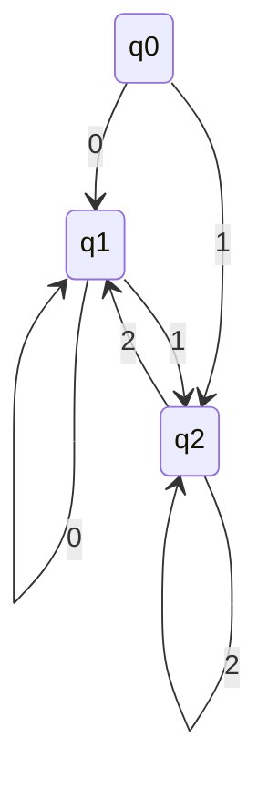

# Minimizzazione di automi a stati finiti deterministici
Capire se un automa è ottimizzato ed in caso negativo, come ottimizzarlo

### Sommario 

- osserviamo che c'è una ridondanza
- una stringa è accettata quando parte da q0 è accettata anche partendo da q2
- possiamo "fondere" q0 e q2 senza alterare il linguaggio riconosciuto dall'automa

#### Problema
- è desiderabile lavorare con DFA "piccoli"
- Avendo a disposizione un DFA, è possibile individurare gli stati ridondanti e "minimizzarlo"?

## Stati (in)distinguibili

### Def
Dato DFA a, diciamo che $p,q \in Q$ sono *indistinguibili* se

$$\hat\delta(p,w) \in F <=>\hat\delta(q,w) \in F$$
per ogni $w \in $\sum^*$
**Nota**
Affinche p e q siano distinguibili non è necessario che $\hat\delta(p,w)$ e $\hat\delta(q,w)$ siano lo stesso stato per ogni w, ma solo che siano entrambi non finali o finali per ogni w

### Def
Diciamo che 2 stati $q,p \in Q$ sono distinguibili se esiste $w \in \sum^*$ t.c. sono una tra $\hat\delta(p,w)$ e $\hat\delta(q,w)$ appartiene a F.
Diaciamo che una stringa w con questa proprietà distinguq p da q

**NOTA**
In generale ci possono essere molte stringhe che distinguono 2 stati

### Esempio

- la tringa $\epsilon$ distingue q0 e q1, in qunaot q1 è finale mentre q0 no
- per lo stesso motivo, la stringa $\epsilon$ distingue q1 e q2
- q0 e q2 sono indistinguibili
	- sono entrambi non finale -> $\epsilon$ non li distingue
	- la tringa 0 non li distingue, poichè li porta entrambi a q1 
	- la tringa 1 non li distingue, poichè li porta entrambi a q2
	- dopo uno 0 o un 1, q0 e q2 confluiscono nello stesso stato e da lì in avanti il loro percorso è lo stesso. -> non può esistere una stringa che li distingua

## Algoritmo per trovare stati distinguibili
- prenod in input un DFA A e restituisco l'insieme di tutte e sole le coppie di stati distinguibili di A

### Algoritmo
1. all'inizio marchio nessuna coppia è marchiata come distinguibili
2. Si marcano le coppie {p,q} in cui $p \in F$ e $q \notin F$
3. Se sistono $p,q \in Q$ e $ a \in \sum$ t.c. {$\delta$(p,a),$\delta$(q,a)} è marcata come distinguibile, si marca anche {p,q} come distinguibile
4. Si ripete il passo 3 finchè non vengono a mancare nuove coppie distinguibili

### Esecuzione algoritmo
- tabella triangolare -> le righe sono etichettare con gli stati dal secondo all'ultimo e le cui colonne sono etichettare con gli stati dal primo al penultimo
- si marchiano le caselle di delle coppie distinguibili
- itero il passo 3

![[Pasted image 20211013123756.png]]

![[Pasted image 20211013125750.png]]

## indistinguabilità come equivalenza
**Proposizione**
L'indistinguibilità è una relazione di equivalenza, ovvero è: riflessima, simmetrica e transitiva

**Notazione**
Fissato DFA:
- indichiamo con ∼ la relazione di indistinguibilità tra stati di A, ovvero p∼q se e solo se $\hat\delta(p,w)\in F <=> \hat\delta(q,w) \in F$ $\forall w \in \sum^*$
- scriviamo [p] per la classe di equivalenza di p
- Scriviamo X/∼per l'insime quoziente di X rispetto a ∼

## Costruione dell'automa minimo
Dato un DFA, l'automa minimo corrsipondente è 
- $(Q/∼,\sum,\delta',[q_0],F/∼)$-> in cui -> $\delta'([p],a)=[\delta(p,a)]$
	- per ogni $p \in Q$ ed $a \in \sum$

è impossibile ridurre ulteriormente il numero di stati dell'automa

## Equivalenza di automi
L'aloritmo riempi tabella può anche riconoscere se 2 automi sono equivalenti

**input**
Dati 2 DFA A1,A2 in cui posso assumere: $Q1 \cap Q2 = \emptyset$
**output**
Vero se L(A1) = L(A2) e falso altrimenti
**Algoritmo**
1. creo l'unione dei 2 DFA dove $\delta(q,a)=\{_{\delta_2(q,a)\ se\  q \in Q_2}^{\delta_1(q,a)\ se \ q \in Q_1}$
2. Si esegue l'algoritmo riempi tabella su A
3. A1 e A2 sono eq. se e solo se q1 e q2 sono indistinguibili in A

[[Linguaggi Liberi]]