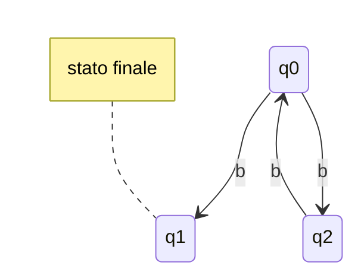
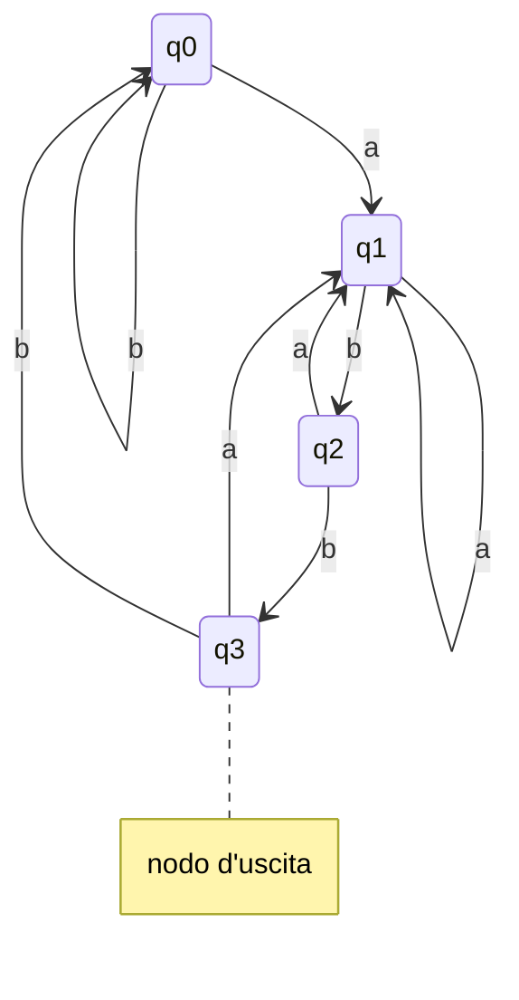
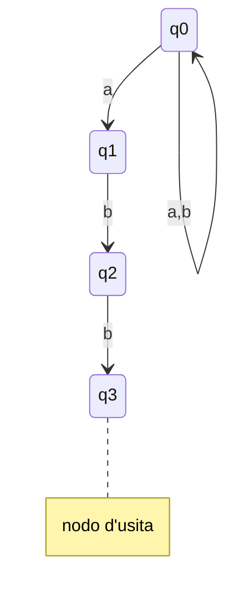

## Automa non deterministico
Automa che può "scegliere" transizioni diverse a partire dallo stesso stato corrente e porssimio simbolo della stringa da riconoscere
$$ \delta : Q × \sum → \wp(Q) $$

### Esempio
Ho il compito di svuotare il recipiente e dire “sì” se il numero di biglie è dispari, “no” altrimenti. **Non c’è la lampada!**

 **Osservazione**
- per ogni n >= 2, il numero *n-2* è pari se e solo se *n* è pari 
- per ogni n >= 2, il numero *n-2* è dispari se e solo se *n* è dispari 

**Soluzione**
mi comporto diversamente in base a quante biglie vedo nel recipiente:
- se il recipiente è vuoto dico "no" 
- se una solo dico "si" 
- se 2 o pùi, rimuovo 2 biglie e ricontrollo 

$q_0$ = guardo reciepente, se vuoto dico "no"
$q_11$ = il recipiente conteneva  1 sola biglia, dico "SI"
$q_2$ = ii recipiente conteneva 2+ biglie, ne ho rimossa 1, tolgo l'altra tornano a q0

## Definizione
Un automa a stati finiti non deterministici (detto NFA) è una quintupla $A = (Q, \sum, \delta, q_0,F)$
- Q è un insieme **finito di stati**
- $\sum$ **alfabeto** dell'automa
- $\delta : Q \ x \ \sum→ \wp(Q)$ **funzione di transizione**
- $q0 \in Q$ **stato iniziale**
- $F \subseteq Q$  insieme di **stati finiti**

### Note (da copiare)
- $\delta(q,a)$: insieme stati in cui NFA può transitare quando nello stato q legge il simbolo a
	- se $\delta(q,a)$ è un singoletto se c'è una sola scelta
	- se $\delta(q,a)$ è vuoto, l'autoa rifiuta la stringa

### Linguaggio riconosciuto da un FNA
La **funzione di transizione estesa** dell'NFA $A = (Q, \sum, \delta, q_0,F)$ è la funzione $\hat\delta : Q \ x \sum^* -> \wp(Q)$ definita per induzione sul suo seconod argomento come segue:
$$\^hat\delta (q,\epsilon)=\{q\} \ \ \ \ \ \ \ \ \ \ \  \ \ \ \ \ \ \ \ \ \ \ \ \ \ \ \ \hat\delta (q,wa) = \{r \in \delta(p,a) | p \in \hat\delta(q,w)\}$$

#### Definizione
Il linguagguio riconosciuto dall'NFA e denotato da L(A) e definito come:
$$ L(A) = \{w \in \sum^* | \^\delta(q_0,w) \cap F \neq \emptyset \}$$
##### Nota
- l'NFA rioconosce una stringa $w$ se esiste un percorso etichettato con $w$ che lo porta dallo stato iniziale $q_0$ a uno dei suoi stati finali $F$
##### Rappresentaizone Tabellare
|Stato|b|
|---|---|
|-> $q_0$|{$q_1,q_2$}|
|q1|$\emptyset$|
|q2|{$q_0$}|

- un inseme **singoletto** indica una transizione **deterministica**
- insieme vuoto -> NFA **rifiuta** la stringa
- gli altri casi indicano transazioni **non** deterministiche

### DFA --> NFA  //Finire di copiare
**Teorema**
dato DFA *D*, ssite NFA* N* t.c. L(N)=L(D)
- **Dimostrazione**
	definiamo N = $(Q, \sum, \delta_N, q_0,F)$ dove
	 $$\delta_n(q,a)=\{(\delta_D(q,a)\}$$ 
Si può dimostrare, per inudzione su $|w|$ che:
$$\hat\delta_D(q_0,w) = p <=> \hat\delta_N(q_0,w$)=\{p\}$$
si conclude che
$$\hat\delta_D(q_0,w$)\in F <=> \hat\delta_N(q_0,w)\cap F \neq \emptyset$$
##### Conseguenze
-  ogni linguaggio regolare è riconosciuto da un NFA
-  il potere riconoscitivo degli NFA è almeno pari a quello dei DFA

### NFA --> DFA
L(D)=L(N)

#### Intuizione
- creiamo DFA son stati = insime di stati dell'NFA
- DFA traccia tutti gli stati in cui NFA si può trovare durante la lettura della stringa
- siccome NFA ha un n finito di stati, lo sono anche quell idi DFA (al massimo $2^n$)

#### Conseguenze 
- ogni linguaggio riconosciuto da un NFA è **regolare**
- conlcudiamo che NFA e DFA hanno lo **stesso potere riconoscitivo**

## NFA --> DFA: costruzione sottoinsiemi
dato un NFA $N$, definiamo $D$ dove
- $Q_D=\wp(Q,n)$, ovvero $Q_D$ è l'insieme dei sottoinsiemi di $Q_N$
- per ogni $S ⊆ Q_N$ e ogni $a \in \sum$ definiamo $\delta_D(S,a) = \bigcup_{q \in S}\delta_N(q,a)$
- $F_D=\{S ⊆ Q_N | S \cap F_N \neq \emptyset \}$

Se si dimostra l'equazione
$$\hat\delta_N(q_0,w)=\hat\delta_D(\{q_0\},w)$$
si può concludere che 
$$ w \in L(N) <=> \hat\delta(q_0,w)\cap F_N \neq \emptyset \ \ \ \ \ def. di L(N)$$
$$<=> \hat\delta(\{q_0\},w\cap F_N\neq \emptyset \ \ \ \ equazione qui sopra$$
$$<=> \hat\delta(\{q_0\},w) \in F_D  \ \ \ \  \ def. di F_D$$
$$<=> W \in L(D) \ \ \ \ \ def. di L(D)$$

### Esempio: stringhe che terminano con abb
- Soluzione deterministica

- soluzione non deterministica

- quando l’automa è nello stato q0 e legge una a, può scegliere se restare in q0 oppure spostarsi in q1 e avvicinarsi allo stato finale
- è come se l’automa sapesse qual è la a che annuncia il suffisso abb (quando c’è)
- l’automa non deterministico ha meno transizioni di quello deterministico

| \ |a|b|
|---|---|---|
|->{q0}|{q0,q1}|{q0,q1}|
|{q0,q1}|{q0,q1}|{q0,q2}|
|{q0,q2}|{q0,q1}|{q0,q3}|
|\*{q0,q3}|{q0,q1}|{q0}|