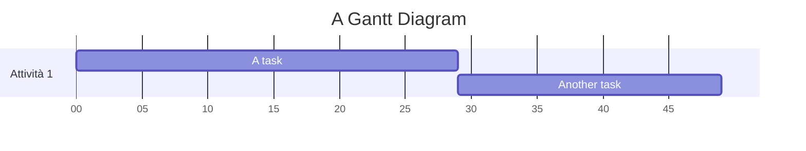
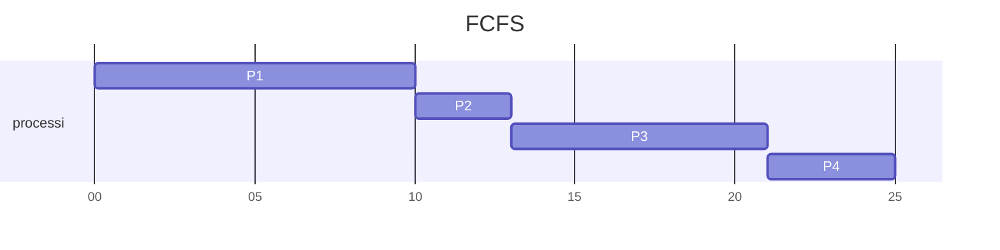
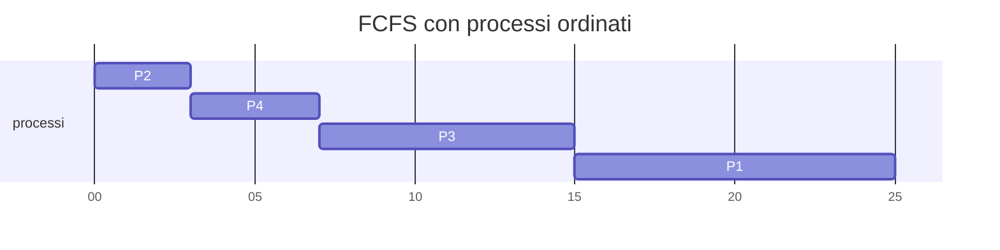
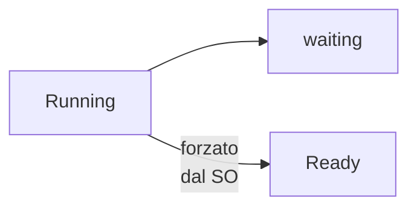
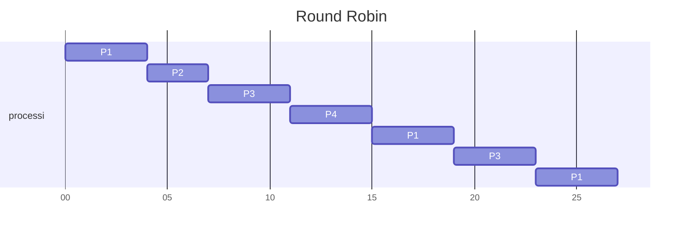

## Coda Ready
- dato insieme di elementi ready, devo sceglioere un criterio per dedicere l'ordine di esecuzione
### Politiche di Scheduling
1. first scan first served (FCFS)
1. Shortest jobs first (SJF)
2. a piorità
3. round robin
4. code multi livello
5. code multi livello con feedback

L'obbiettivo è essere il più efficenti possibili

### Throughput
- Misura il tempo... quale tempo?

- Voglimao minimizzare il tempo medio di attesa

### Diagramma di Gantt
Ideato nel 1917 per gestire progetti 

 - y -> attivita
- x -> settimante di lavoro 

(Mi sono distratto per colpa di Ale)

|P|D|
|---|---|
|P1|10|
|P2|3|
|P3|8|
|P4|4|

D -> Durata del prossimo CPU-BURSRT

### FCFS
- P1 ottiene la cpu e la tiene per 10 (secondi/istanti.. nonm è impostante l'unità di misura)
- poi passa a P2, P3, .., Pn 

- Diagramma di GANTT per l'FCFS
- il totale del D deve essere  = al valore finale del diagramma di Gantt
 
 |P|D|
|---|---|
|P1|10|
|P2|3|
|P3|8|
|P4|4|
|tot| 25|
##### Temi di attesa dei singoli porcessi 
- P1 = $\emptyset$
- P2 = 10
	- -> tempo medio di attesa 44/4 = 11 
- P3 = 13
- P4 = 21

- Se i Processi fosse analizzati in un ordine diverso: 

 |P|D|
|---|---|
|P2|3|
|P4|4|
|P3|8|
|P1|10|
|tot| 25|

##### Temi di attesa dei singoli porcessi 
- P2= $\emptyset$
- P4 = 3
	- -> tempo medio di attesa (0 + 3 + 7 + 15)/ 4 = 6,25 
- P3 = 7
- P1 = 15

### SJF
- coda ready ordinata
- prima processi con cpu-burst stimato più breve
	- è una variante di FCFS che mantine la coda ordinata

** DIfetti**
- Rischio che i processi più lunghi, vengano sempre sorpassati da processi più brevi
	- Starvation -> quando un porcesso che ha bisogno di risorse, non le ottiene mai
---
Come Calcolo il CPU-Burst? 
- la possiamo solo stimare con una formula:
	 $$\tau_{n+1}= \alpha t_n+(1-\alpha)\tau$$
	- $\tau_{n+1}$ = stima del prossimo cpu-burst
	-  $t_{n}$ = esatta durata del cpu-burst precedente
	-  $\tau_{n}$ = stima del precedente cpu-burst
- Ho n esecuzioni precendenti
	- grazie alla motipliczione (1- $\alpha$) posso ridurre l'impostanza dei valori più lontanti nel tempo e dare più peso alle ultime esecuzioni 

### Algoritmi di scheduling cpu a priorita
1. priorità definita dagli uteni
2. priorità calcolata in base a caratteristiche del processo

## Prelazione
- soppressione forzata di una risorsa

- un processo richiede troppo tempo, quinidi viene "sospeso" dal SO e torna in stato Ready (gli manca solo la cpu per continuare)

### Round Robin
- è una versione modificata dle FCFS
- ha bisogno di un supporto dall'architettura
	- un timer dedicato
		-  Quanto (di tempo) : 4 -> valore per il timer

 |P|D|
|---|---|
|P1|10|
|P2|3|
|P3|8|
|P4|4|
|tot| 25|
- p1 chiede 10 unita di tempo, ma il quanto è 4, quinid dopo 4, viene sospeso dalla cpu e si passa al prossimo
- p2 conclude in tempo
- ...
	- i processi hanno bisogno di essere ripresi più volte
		- si riparte da 1,2,..., 

##### Attese dei processi
- P1 : 0 + 9 + 4 -> 15
- P2: 4
	- tempo medio: 11,qualcosa 
- P3: 7 + 8 -> 15
- P4: 11

### Scheduling CPU a code muiltilivello
- la coda ready viene articolata in più code
	- con priorità diverse
	- i processi sono suddivisi in base alle loro caratteristiche
	- code diverse, possono avere shceduing diversi

- si dicono Multilivello con feedback, qunado i processi possono saltare da un cod a priorità minore, ad una a priorità magiore
	- serve per evitare lo **Starvation** e viene detto **Aging** 

## Prelazione

Meccanismo che premette al SO di sottrarre una risorsa(cpu) a un processo(running)

#### RIassegnare la cpu a un altro processo
Avvine in 4 circostanze diverse 
1. processo running diventa waiting
2. processo running viene riportato a ready
3. processo waiting diventa ready
4. processo running termina

- caso 1 e 4 -> no prelazione -> rilascio volontario della cpu
- prelazione solo nei casi 2 (es. nel round robin) e 3

Shortest jobs first ( senza prelazione) -> presenta una variante con prelazione -> *Shortest remaining time first*

- se un nuovo processo richede poco tempo può finire in testa alla coda ready
	- se ne richiede meno di quanto ne richiederebbe quello in esecuzione per finire, lo può spostare nello stato waiting per eseguire quello nouvo più breve

- La prelazione richiede un supporto HW

[[05. Processi]]