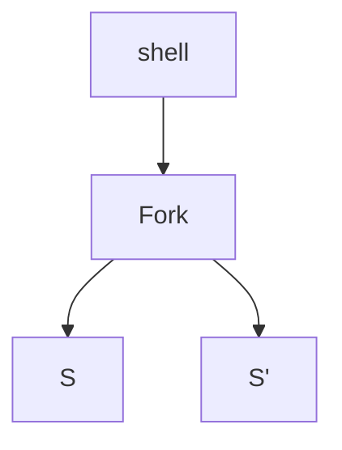
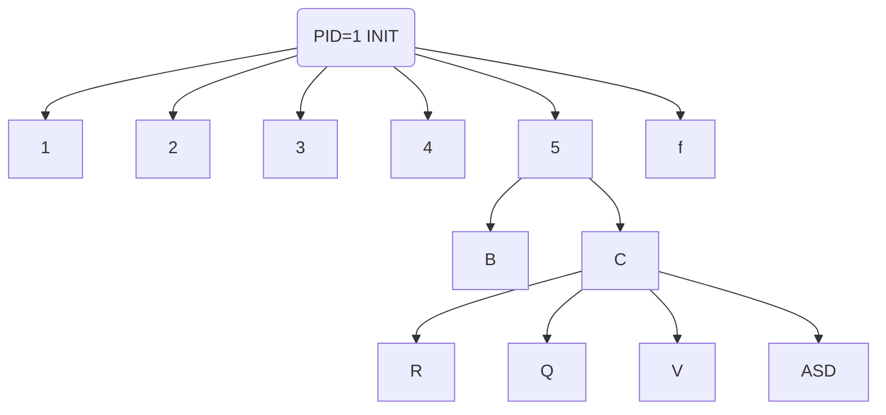

## Processi: creazione e terminazione 
- Sappiamo come è fatto un processo(PCB, struttura dati -> esecuzione ...)
- Come si creano?
	- Un processo è creato da un altro processo
	- Alla creazione, un processo è uguale a quello che lo ha generato
		- quando premo invio per eseguire il mondando "ls" viene creato il processo ls... Come?
			- La shell ricevuto il comando, esegue una fork che genera 2 processi: uno uguale alla schell originale (S) ed un S' inizialmente identico, ma va poi ad eseguire il codice del nuovo comando (è cambiato il riferimento al programma all'interno del PCB)
				- il tutto avvieen grazie a delle syscall (tra cui EXEC)
			- Rimane una relazoine padre/figlio tra i 2 processi generati  

### Albero dei processi

- i processi che stanno più in basso muore prima del processo padre (generalmente viene creato per svolgere una funzione utile al processo padre)
- Al termine di un prcoesso, il suo PCB non viene subito eliminato, perchè mantiene un informazione sul come vine terminato (in base a ciò il processo padre può agire diversamente)

1. P produce F via Fork
2. F termina
3. P ispeziona** info sul terminazione** del processo figlio (wait) <- processo zombie
	1. se non si leggono le info, rimangono nella ram ad occupare memoria creando problemi 
4. info sulla terminazione di F vengolo raccolte

- Se termina prima il processo padre del processo figlio?
	- Procede come nulla fosse come processo orfano, e viene "adottato" dal processo con PID=1 (INIT)

## Sistema SW articolato in tanti processi

- es: P1 riceve dati dall'estenro -> li passa a P2 che esegue cose belle -> li passa a P3 che li prepara all'output
	- il vantaggio che i vari processi possono "portarsi avanti" iniziando a lavorare i dati successivi mentre altri stanno finendo con i precendenti
- il tutto si definisce pipeline
	- ci possono essere casi di processi che lavorano in parallelo, non solo in succesisone

i processi possono essere:
- Cooperanti (comunicare)
- Competitivi (competono per le risorse)

#### Processi Cooperanti
Modelli di comunicazione:
1. Modello a memorica condivisa
2. Modello a scambio di messaggi

| Soluzione Monolitica | Soluzoine a processi cooperanti |
| -------------------- | ------------------------------- |
| 1) Leggo D           | P1 Leggo D  |
| 2) passo A           | P1 Passo A  |
| 3) Passo B           | P2 passo B P1 Leggo D'|
| 4) *Ricomincia*         | *Sovrappongo l'esecuzione di B alla lettura del dato successivo*|

- **Memoria Condivisa**
	- area accessibile a diversi processi (Read/Write)

- **Scambio di Messaggi**
	- richiede un mezzo -> una coda di messaggi (apparentemente una memoria condivisa)
		- i processi non sanno come è implementata la coda di messaggi, ma sfruttano le primitive "send" "recive"  
	- Scambi Diretti/Indiretti
		- Diretti: il processo deve conoscere l'identità del processo con cui comunica( P1 per madnare messaggio a P2, deve conoscere il suo PID) send(m,P2) <--> recive(m,P1)
			- La coppia P1,P2 definisce un canale di comunicaizione
		- Indiretti: Mailbox, i mittenti possono depositarci i propri messaggi: send(m,M) -> M indentificatore mailbox
		- idem per ricevere: recive(m,M)
			- processi debolmente accoppiati -> da più robustezza al sistema (se muove un processo e viene sostituito con PID diverso, il tutto continua a funzionare) 

## Scambi di messaggi

### Buffer
- caratterizzato dalla capacità -> quantita di messaggi
	1. a capacità 0
		- il processo mittenete mantiene il messaggio nelle proprie strutture dati
		- il mittente rimane bloccato finch'è il ricevente non "ritira" il messaggio 
	2. a capacità limitata
	3. a capacità illimitata 

- 2 tipi di send
	- sincorna -> il mittente si sospende finchè non si libera una zona del buffer
	- asincrona -> lo mette nella mailbox e continua a fare i fatti suoi

- 2 recive
	- sincorna -> si ferma ed aspetta che arrivi un messaggio nella coda
	- asincrona -> va a cercare un messaggio - non lo trova - continua a lavorare comunque, senza fermarsi ad aspetttare
		- serve meccanismo di polling per controllare ogni tot. se c'è un messaggio ( e cosa fare nel frattempo se non lo trova) 

send + recive sincrone -> si dice "rendez-vous"

** Memoria condivisa del buffer**
send e recive nascondono una serie di meccanismi, per mantenere consistente lo stato del buffer (così i proces. non se ne devono preoccupare)

#### Implementare scambio di msg
- Socket -> sistema client (richiesta) / server (eroga un servizio)
	- 192.168.1.14:80 <- la porta è un socket (il server rimane in ascolto sulla porta)

#### Remote procedure call (RPC)

- un processo rischiede l'esecuzione di una procedura su una macchina diversa 
	- processo con istruzioni....in mezzo c'è uno RPC (STUD) -> permette di trovare la macchina remota in ascolto  e la porta -> il server esegue la procedura richiesta
	- come conosco la porta?
		- o è hard-coded (scritta direttamente nel codice), o sfrutta sistemi esterni di Match Maker per essere più flessibili

#### Pipe
Anonima o con nome
- Anonima:
	- Canale si comunicazione simplex (solo ricevente o mittente)
	- i messaggi vengono accodati e gestiti come First in first out
	- es. processo P crea pipe anonima -> crea processo figlio -> manda messaggi attraverso la pipe anonima Pipe
		- La pipe svanisce quando termina il processo creatore

[[06. Thread]]