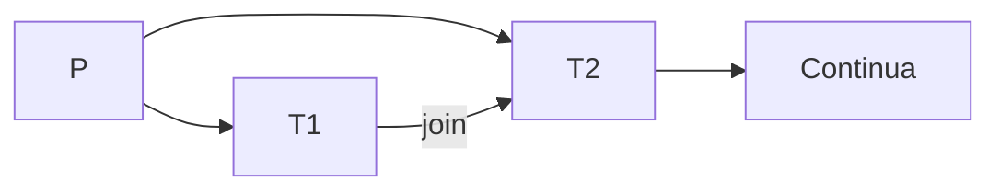
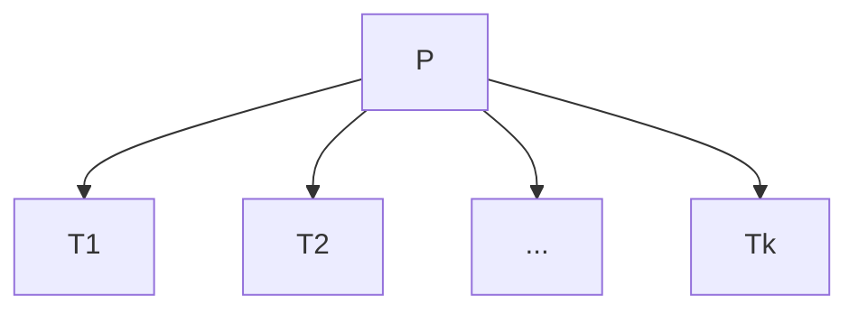
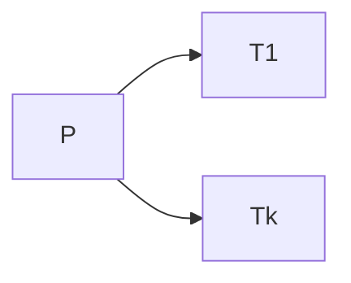
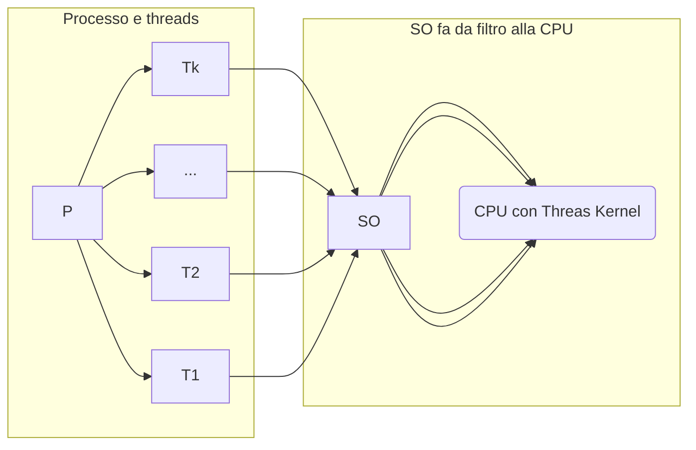

## Thread
Simile al concetto di processo, è più vicino all'idea di un sottoprocesso
- Se devo calcolare f1 + f2, è più comodo calcoalre f1 || f2 e poi sommarle.
	- potrei generare 2 processi figli, ma è un po' troppo esagerato ata la semplicità del compito
	- Quinidi uso i threads
		- ogni treads ha un suo identificatore (TID) ed un suo stack  
		- possono eseguire solo il codice del processo
		- Hanno le variabili globali in comune

P diviso in T1 T2 e T3
- Se eseguo una fork, non è detto che venga duplicata tutta la struttura
	- l'inverso della fork è il Join
- Se P geenra T1 e T2, posso metterene  1 in attesa della conclusione dell'atro (le 2 esecuzionni "convergono")  

### Thread Utene e Kernel
- Sono interni ai processi
- Divisi in
	-  Utente (quando sono gestiti dai processi, all'interno dei processi)
	-  Kernel (è un po' più trasparente al SO e vede la struttura del processo)

### Thread Utente
- lo scheduling dei Thread, può essere personalizzato dal singolo processo
- Il content switch tra thread interni è un po' più veloce
- Se un thread deve ricevere input/ produrre output / sincronizarsi per un messaggio, si blocca l'esecuzione ti tutto il processo

### Thread Kernel
- scheduling della cpu a livello dei thread
- Si può mettere in waiting il singolo thread al posto di tutto il processo

- Il sistema Operativo fa lo scheduling della CPU a livello dei PCB o dei Threads
	- Li chiamo Unità di computazione, per generalizzare il tutto
		1. 1-1: Per ogni thread utente, assegno 1 **unità di computazione** (chiamate spesso thread kernel)
			- implica shceduling a livello dei threads 
			- Problema: se un processo crea troppi threads
		1. 1-MOLTI: tanti threads utente -> una sola unità di computazione (vine assegnato un processo intero all'unità)
		2. Molti-Molti: Assegna a ciasun processo, un numero di thraeds kernel limitato
			- Il processo può avere in esecuzione al più X threads
				- Quindi il programmatore deve decidere quali threads rendere visibili al sistema operativo e mandare in esecuzione
				-  LWP (Light Weight Process || Risorse) <- parte dello scheduling a carico del sisteam operativo

[[07. Proc. conc. asinc.]]