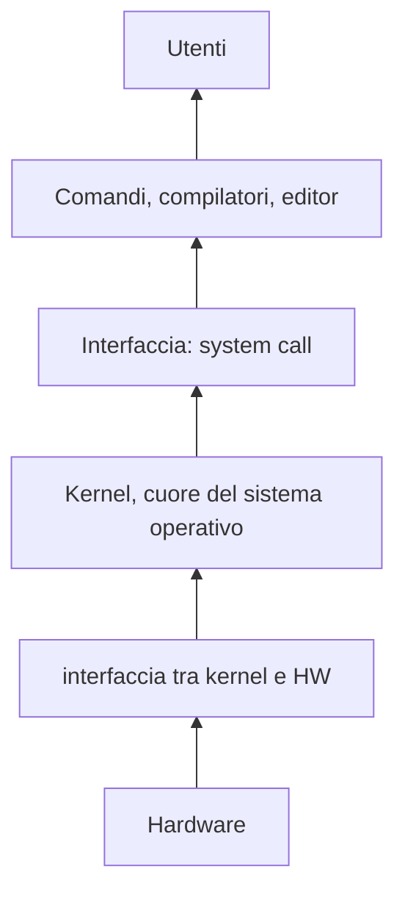
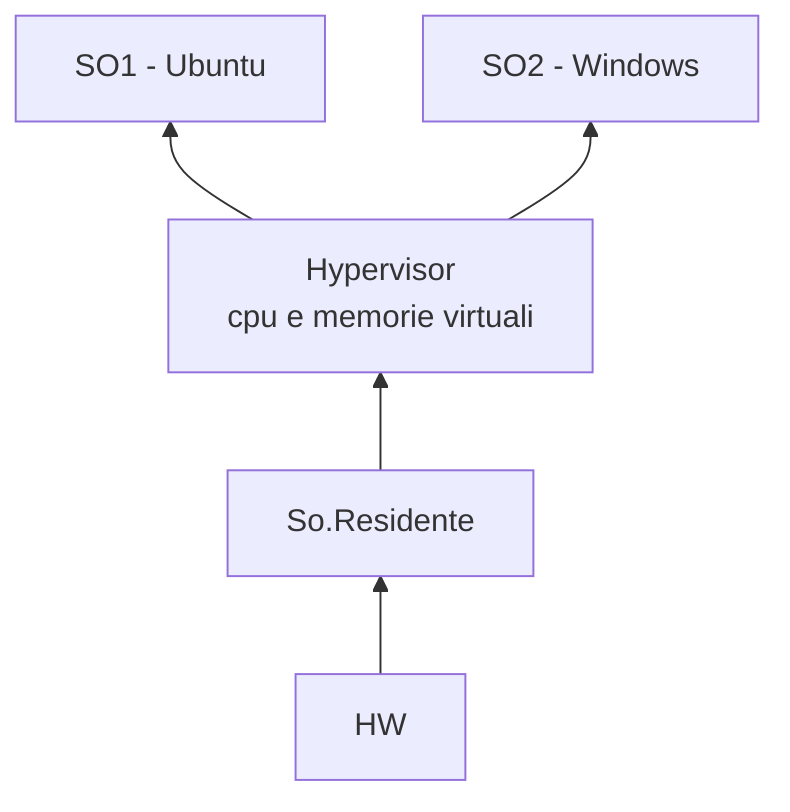
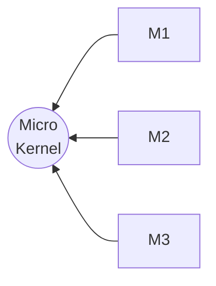
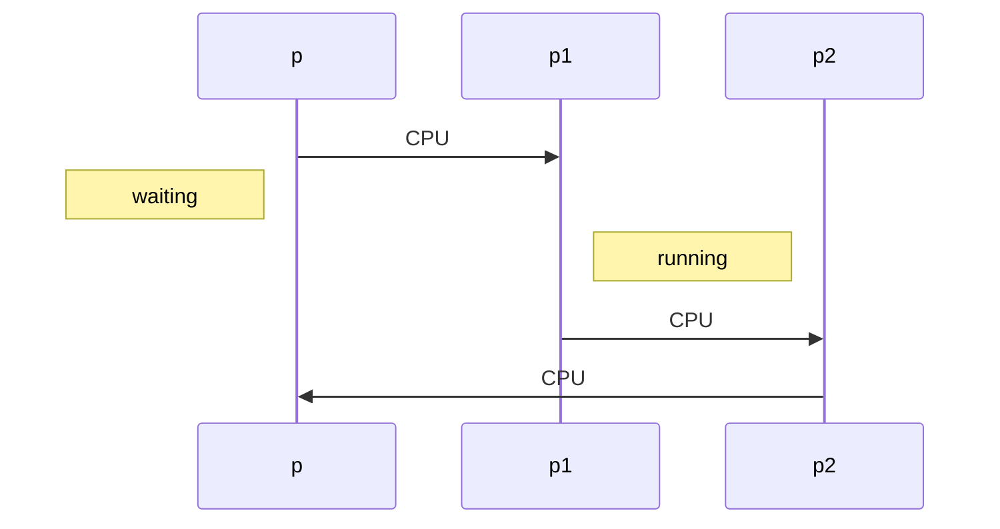

## Struttura architetturale di un SO
- Originariamente scritti per una pecifica arhcitettura
	- sfruttando il suo linguaggio assembly 
- Adesso si usa un linguaggio iù ad alto livello (come il C)
	- permette una portabilità del SO

### UNISCS 
Struttura stratificata (gli strati centrali rappresentano il SO)
- Utenti
	-  Comandi, compilatori, editor
	- Interfaccia: system call
	- **Kernel, cuore del sistema operativo (gestisce processi, file system, segnali ...)**
	- interfaccia tra kernel e HW (Driver)
	- Controller dei dispositivi (sempre hardware)
- Hardware

Sviluppando il kernel dopo dopo i driver e l'HW posso permettermi di renderlo indipendente da essi
- non mi interessa come sono implementati i driver, basta sapere come invocarli (magari tramite un metodo standardizzato)

	- Ragionamento simile per le sys.call


Quindi: ogni **livello nasconde i sottostanti**, rendendoli indipendendti nello sviluppo

## Contro
- il ragionamento a stranti non è banale
- più strati ci sono, più è lenta l'esecuzione (ogni comando deve scendeer e risalire i vari strati)

La truttura stratificata, era stata abbandonata per un periodo, ma è tornata in auge con le macchine virtuali e i sistemi cloud



Durante il periodo di "assenza" della stratificazione, si è utilizzato il sistema "micro-kernel"
- il kernel deve gestire meno cose possibile
	- processi
	- memoria
	- comunicazione (scambi di messaggi)

- Tutte il resto sono pogrammi applicativi  -> moduli 


La comunicazione è quello che ha reso il tutto più ostico.
- se m1, deve comunicare con m3:
	- m1 manda il messaggio al kernel
	- il kernel lo rigira ad m3
	- m3 riceve il messaggio
	- m3 manda la risposta al kernel
	- il kernel la rigira ad m1 

Adesso si tenta di mantenere un kernel snello con l'aggiunta di moduli (anche a sistema avviato)

bisogna definire dei criteri ---> implementare tramite meccanismi 
   - (criterio -> aule da riempire al 50% | meccanismo -> sistema di prenotazione con max 50% dei posti)
   
   ## Diagrammi di transizione di stato
   ```mermaid 
flowchart TB
	nuovo --> ready 
	ready --> running
	a[Coda ready] --> running
	running --exit--> terminare
	running --> waiting
	running -.-valori-registrati-.-> PCBp
	running -- abortito --> terminare
 	waiting --> ready
	running --> ready

```
   
   - **SO** mantiene process conrol block -> PCB
   		- identità del processo
   		- program counter
   		- riferimeto al codice
   		- registri della cpu
   		- info. uso della ram
   		- contabilizzazione 
   		- info. stato I/O
   	- Fanno tutte informazione che fanno parte del PCB



- tutti i salti con "CPU" sono **Content Switch**
	- il processo con cpu è quello in esecuzione, gli altri vanno in waiting
- Un content switch dura pochi nano secondi 

## Scheduling
Abbiamo un gruppo di richieste
- Dobbiamo scegliere la prossima da servire

Scheduling a lungo/medio/breve termine
 - lungo termine -> P in running termina e pesca uno dei Pn già presenti nella meoria di persistenza (è circa il sistema di funzionaente dei sistemai operativi di prima generazione)
 - medio temrine (Swapping) -> P in running e Pn in ram, ne vengono mandati in esecuzione più di qunati ce ne stanno nella ram -> li salvo nella memoria persistente (Pn+1 .. Pm) --> lo swapping ogni  tanto scambia i processi in ram con quelli in memoria
-  - breve termine -> P1-4 nella ram, lo scheduling decide qual'è il prossimo processo ad entrare in eseuczione (p1,p2,p3,p4 $\in$ coda ready)
