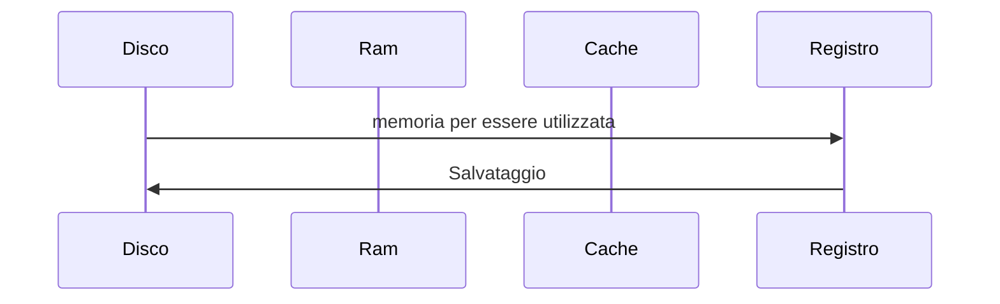
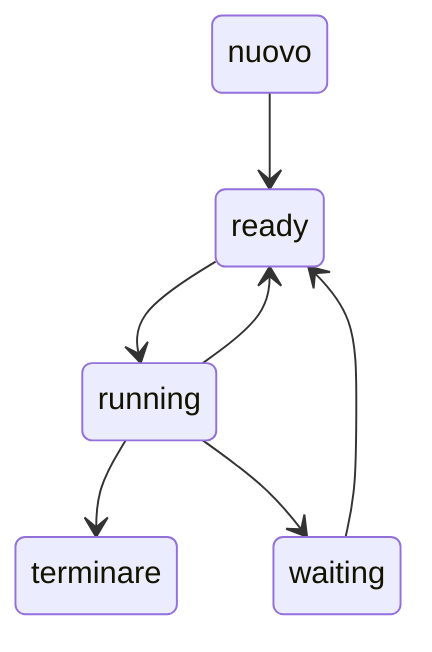

# Sistemi operativi

## Introduzione
- cos'è un sistema operativo? 
- a cosa serve?

1) HW -> hardware
2) ???
3)  Eseguzione programmi (if x<10 ... ecc)

Il sistema operativo fa da mediatore tra l'HW ed il programma da eseguire (è software)

Quindi, il nostro elaboratore è un dispositivo fisico (liv.0), "controllato" dal sistema operativo(liv.1) su cui eseguiamo i nostri programmi applicativi (liv.2) 

- SO 
	- gestore di risorse
	   - FIsiche (cpu, mem ecc..)
   	- Software (code di messaggi, semafori, processi, thread ecc...)
	- Fa da controllore
		- es. killa un processo se prova ad accedere ad una seione di memoria a cui non dovrebbe (es. assengazine valore a posizione array inesistente)
	
	[[Storia]]

## Avvio di un sistema operativo
 Il SO viene avviato da un processo detto **BootStrap**
 
 - parte p1, esegue p2, che esegue p3 --> .. pX

1. Il primo processto è il Bios (basic I/O System)
1. Eventuale esecuzione del Boot Loader (se sono presenti più sistemi)
1. Arriviamo al SO
	- aspetta che capiti qualcosa
	
### Evento
E' la notifica che e' occorsa qualcosa
- Eventi Hardware (Interrupt)
- Eventi Software (Trap)

Per ciascuna tipologia e' associato un **handler**, che vengono inseriti in una coda di eventi.

#### Vettore delle interruzione
Permette l'accesso all'handler, contiene i riferimenti alle istruzioni che implementano gli handler per ogni interruzione.

Ongi tipo di interruzione e' codificato con un numero, l'indice della posizione contenente l'handler necessario
-  es. Nella posizione 0 del vettore è presente il condice Handler per accedere  a gli eventi di tipo 0 ecc..
- Questa porzione del sistema operativo e' chiamata **Dispatcher**  --> smistamento degli eventi ai vari handler
- 
## Content switch
1. duraren l'esecuzione di un codice P, quando ci si inbatte in un evento (es. input), le info del codice venogono salvate e l'esecuizone congelate per liberare la cpu
1. così l'OS può caricare l'handler dell'evento in questino (es. ricevere il dato in input)
3. La cpu è di nuovo libera e viene riassegnata al codice dell'utente che può riprendere l'esecuzione

## Gestione Meoria
### Memoria principale -> RAM
- unica memoria di gande capacità direttamnte accessibile dalla cpu
CPU <--> RAM  $\ \ \ \ \ \ \ \ \ \ \ \ \ \ \ \  .$ DISCO -> il suo contenuto deve essere trasferito sulla ram per essere sfruttato 

- il processo di salvataggio può fermarsi ala RAM se non serve salvare il dato permanentemente

## Device / Dispositivi
Tutto ciò che non è cpu o memoria

Per interagire con i device si usano:
	- HW -> Controller
		- può essere visto un mini (molto mini) pc all'interno del device 
	- SW -> Driver di dispositivo 
	
## Cpu
#### Architettura
-  Per il corso partiamo dall'idea che le CPU siano single core (per evidenziare meglio i "problemi")
	- tutti i processi sono eseguiti in parallelismo virtuale  
-  Con un architettura multi core posso avere del parallelismo reale
	- hanno un collo di bottiglia con l'accesso alla memoria
		- se serve eseguire 3 read sulla setessa memoria, vengono messe in coda

## Creazione SO
 So:
 - sw che manipola strutture dati
 - strutture dati rappresentano dell'informazione

Serve identificare le giuste **astrazioni** per ogni elemento da gestire

#### Processi
- Bisognsa dare una rappresentazione ai processi
	- gli si da un identificatore
	-  un riferimento al codice
	-  un riferimento allo stack
- il SO ha bisogno di poter assegnare della memoria Ram ai processi
	- ed impedire aventuali interferenze
#### CPU
- Ogni cpu ha il proprio Instrution set
- esegue sia processi utente che processi di Sistema Operativo
	- i P. utenti possono usare tutto Instruction set o deve avere dei limiti? 
		- servono dei limiti, in quanto potrebbero interferire con altri processi / alterare dati di sistema
#### Dual Mode
- si ha una parte dele istruzioni eseguibile da tutti i processi
- ed una eseguibile solo dal sisema operativo  
	- L'architettura fornisce il Bit di modalità
		- 1 = modalità utente
		- 0 = modalità Kernel (SO)

#### System Call

Per eseguire comandi a livello kernel si usa la **system call**, per far passare il bit della modalita' utente a quella di modalita' kernel ad un'istruzione.

Quanto si esegue una SC di genera un trap che causa l'esecuzione di un handler, la quale riconosce la chiamata e causa l'esecuzione di un handler specifico per la SC di riferimento.

Se la system call fallisce il processo viene reciso.

Esistono 5 tipi di system call:
- controllo dei processi
	- Terminare di un processo (exit( ))
	- Processi generati da processi (fork( ))
- gestione dei file
	- creazione file
	- lettura file 
- gestione dei device
- gestione delle informazioni
- comunicazione

## Cilco di vita di un processo
### Diagramma di transizione di stato dei processi

[[Storia]]