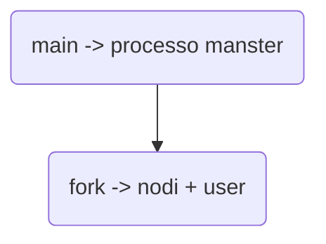

| Nome File    | Descrizione                          |
| ------------ | ------------------------------------ |
| makefile     | file di costruzione                  |
| setting.conf | parametri da decidere all'esecuzione |
| main.c       |                                      |
| nodo.c       |                                      |
| user.c       |                                      |

