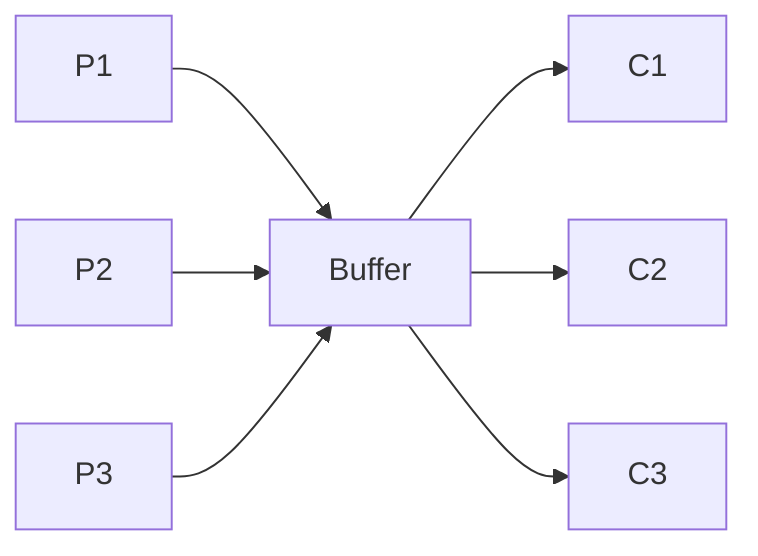
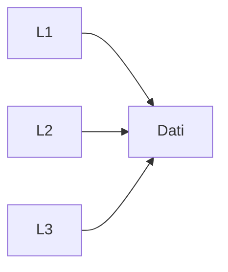

## Sincronizzazione
### Problemi Classici di sincronizzazione
1. problmema dei produttori-consumatori
2. problema dei lettori-scrittori
3. problema 5 filosofi


#### Produttori-Consumatori
Devono scambiare dati, utilizzando un buffer di capienza limitata

Pi -> produttore generico, inserisce dati nel buffer
- sospeso se il buffer è pieno

Cj -> consumatore generico, estrare dato dal buffer
- sospeso se buffer è vuoto

**Soluzione**
- Semaforo Mutex  di mutua-esclusione
- Semaforo conatore Libere
- Semaforo constatore Occupate

Sem Mutex inizializzato a 1;
Sem Libere inizializzato alla dimensione del buffer (N);
Sem Occupate inizializzato a 0;

**Produttore**:
```C
forever{
Produzione.elemento();
P(Libere); 			        <- blocca se non ci sono celle libere
P(Mutex);  				    <- garantisce mutua esclusione
<<S.C.|prduci.elem()>>;
V(Mutex);
V(Occupate);
}
```
**Grafico**

**Consumatore**
```C
fprever{
P(Occupare);			<- blocca se non ci sono celle occupate
P(Mutex);				<- garantisce mutua esclusione
<<S.C.|estrai.elem()>>;
V(Mutex);
V(Libere);
}
```

#### Lettori-Scrittori
1. Non ci sono limiti di spazio
2. I lettori non consumano il dato

**Mutua esclusione**, imposta solo agli scrittori

- i lettori possono leggere insieme
	- Appena arriva uno scrittore, si devono fermare tutti 

**Soluzione**
- Semafono Mutex = 1;  --> Di mutua esclusione
- Semaforo Scrittura = 1;  --> Di mutua esclusione
- int numLettori = 0 --> vrb. condivisa

**Scrittore**
```C
fprever{
	P(Scrittura);
	<<S.C.|scrivi.elem()>>;
	V(Scrittura);
}
```
**Lettore**
```C
fprever{
	P(Mutex);         <-- controlla accesso a variabile numLettori
	numLettori++;
	if(numLettori==1)  --> il lettre è solo
		P(Scrittura);
	V(Mutex);
	<<Legge()>>;
	P(Mutex);
	numLettori--;
	if(numLettori ==0) --> se era l'ultimo lettore
		V(Scrittura);
	V(Mutex);
}
```

#### 5 Filosofi
- 5 filosofi (i processi)
- per mangare hanno bisogno delle posate (accesso alle risorse condivise)
- le posate sono condivise per coppie (P2 sono utilizzabili da F2 e F3, P3 da F3 e F4)
	- quindi sono da prendere in Mutua sclusione 2 a 2

Possono generarsi situazioni di:
- Deadlock (bloccati in attesa di un evento, che può generare solo un altro  processo, bloccato anch'esso)
-  Sarvation 
-  Livelock

```C
forever{
	<<pensa>>
	<<mangia>>
}
```

##### Deadlock
- codice che porta al deadlock
```C
fi:
	forever{
	P(p[i]);
	P(p[((i+1)%5+1)]);
	<<Mangia> / SC>
	V(p[i]);
	V(p[((i+1)%5+1)]);
	}
```

- bisogna rompere la simmetria per evitare il deadlock (ma persiste la starvation)
	- se F5 ed F3 usano le risorse, F4 non è la libere ed F1,F2 ne hanno solo 1 diponibile.
	- Appena F5,F3 finiscono possono rilasciare le risorse e riprenderle subito -> creando starvation 

##### Chandy - Misra
Per risolvere il problema dei 5 filosofi, serve una priorità variabile 
- Chi ha già utilizzato la risorsa, si vedrà abbassare la sua priorità, lasciando così andare chi non l'ha ancora usata

- Associare stato alle "posate": sporche/pulite
	-  posata pulita -> non ancora utilizzata il Processo la mantiene
	-  posata sporca -> utilizzata, se un altro la chiede, viene rilasciata

---
Cliente-Barbiere
- Cliente
```C
cliente(){
	P(Mutex)
	if(in-attesa<N){
		in-attesa++;
		v(Mutex);
		V(Cclienti);
	}
	else
		v(Mutex);
}
```

---

Alcuni linguaggi sfruttano livelli ancora più astratti dei semafori per garantire la sincronizzazione, detti monitor

**Monitor**
- Un monitor, può essere visto come una classe, 
	- con delle varaibili condivise
	- dei metodi -> eseguiti in mutua esclusione
		- garantito dall'implementazione di semafori nel codice del monitor (nascosi al programmatore che sfrutta i monitro)
	- Variabili di tipo condition (anch'esse sfruttano i semafori)
		- x.signal() / x.wait()  -> diversi da P e V

---

## Transazioni
- CC-cliente = 100
- CC-venditore = 1000

Transazione
- CC-cliente = 50
- CC-venditore = 1050

Che succede le la transizione si interrompe a metà? (tolgo 50 al cliente, ma il venditore rimane a 1000)?
- Il sistema rimane in uno stato inconsistentea
	- Bisogna riportare il tutto allo stato consistente precedente (riportare CC-cliente = 100)
	- quanto si completano tutti i passi, si dice che si esegue un "commit", se qualcosa va storto e si torna indietro, si fa un "abort"

**Memorie Volatili**
- Si può utilizzare un logfile $\in$ filesystem (rimane in una memoria persistente)
	- Serve un formalismo da usare nel log "<T, start> / <write, var, prec, new> .... <T, end>"
	- Nel caso perda i dati nella memoria volatile, recupero il log e verifico le transazioni.
		- Per quelle con start e end, sono a posto e concluse
		-   Per quelle con start ma non end, posso esseguirene il rollback 
	- Ogni tot. ci possono essere dei checkpoint (tutto il precedente è ok, quinid posso non leggerlo)
	- Scrivendo in memoria secondaria, più lenta, vado a rallentare l'esecuzione   