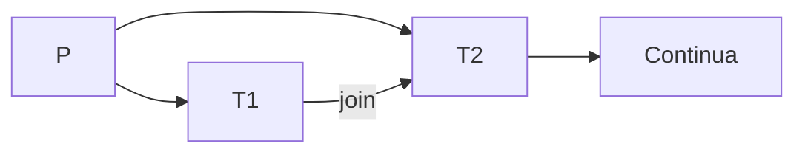

## Thread
Simile al concetto di processo, è più vicino all'idea di un sottoprocesso
- Se devo calcolare f1 + f2, è più comodo calcoalre f1 || f2 e poi sommarle.
	- potrei generare 2 processi figli, ma è un po' troppo esagerato ata la semplicità del compito
	- Quinidi uso i threads
		- ogni treads ha un suo identificatore (TID) ed un suo stack  
		- possono eseguire solo il codice del processo
		- Hanno le variabili globali in comune

### Thread Utene e Kernel
P diviso in T1 T2 e T3
- Se eseguo una fork, non è detto che venga duplicata tutta la struttura
	- l'inverso della fork è il Join
- Se P geenra T1 e T2, posso mettereìne  1 in attesa della conclusione dell'atro (le 2 esecuzionni "convergono")  

