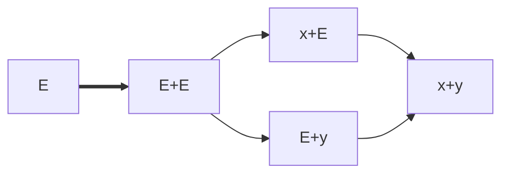
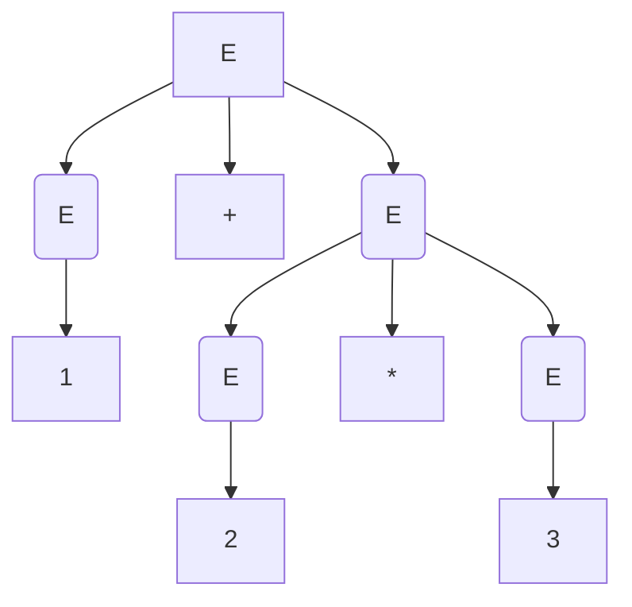

## Esempio: comando di assegnamento in Java
grammatica: $$(\{S,R,E\},\{=,[,],c,x\},P,S)$$

In cui P è l'insieme di produzioni
- S -> R = E
	- R -> x | R[E]
	- E -> c | R

## Esercizi
1\)  $(\{S\},\{a,b\},\{S -> \epsilon | aaSb\},S)$	
- S => $\epsilon$ -> stringa vuota
- S -> aaSb (riutilizzo la prima produzione) => aab
- S -> aaSb (riutilizzo 2° prod.) -> aaaaSbb ($1^a$ prod)=> aaaabb ...

$L(G) =\{a^{2n}b^n|n \geq 0\}$

2\) Linguaggio generato dalla stringa (ab)*
- $\epsilon$, ab, abab. ababab,ab...ab
S -> $\epsilon$ | abS
- $(S,ab,P,S)$

---

# Alberi sintattici, derivazioni canoniche e ambiguità

E -> x | y | E + E | E \* E | (E)

## Alberi sintattici
**Definizione**
Data una grammatica G=(V,T,P,S), gli alberi sintattici di G sono alberi con le seguenti caratteristiche
- Ogni nodo interno è etichettato con variabile V
- Le foglie sono eticchetate con V, o terminale T o $\epsilon$
- Se foglia etichettata con $\epsilon$, è l'unica figlia del genitore
- Se un nodo interno è etichettato con A e i suoi figli sono etichettati con X1,X2..Xn, allora A -> X1,X2,..Xn è una produzione in P

**Defnizione**
Prodotto di un albero è la stringa ottenua concatenando, da sx a dx, le etichette di tutte le foglie di dell'albero

**Teorema**
A =>$^*_G\alpha$ se e solo se esiste un albero ...

**Esempio**
G=({E},{0,1...,9,+,\*,(,)},{E -> 0| ..| 9 } ) (__finire copia__)

**Def**
Una grammatica è ambigua, se esistono più alberi sintattici distinti con lo stesso prodotto

## Ambiguità  e derivazioni (fninire)
- bastano 2 aberi distinti con lo stesso prodotto per dire che una grammatica è ambigua
- non bastantno 2 derivazioni distinte per dire che una grammatica è ambigua

## Derivazione canonica
**Def**
si dice Defivazione canonica sinisra, se ad ogni passo di riscrittura, viene riscritta la variabile più a sinistra(stesso ragionamento per la speculare a destra).
Useremo =>$_{lm}$ per le derivazionii a sinistra (\_rm per quelle a destra)
