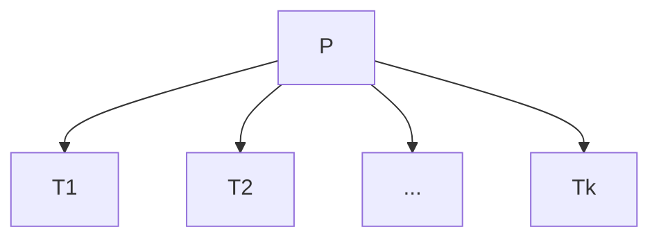
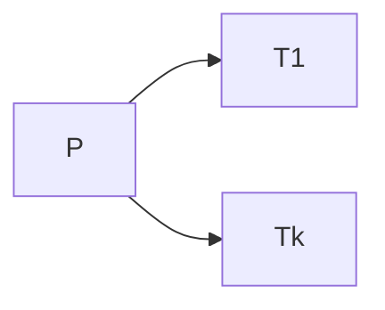
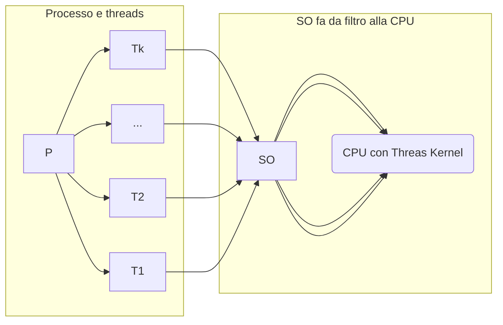

## Thread
- Sono interni ai processi
- Divisi in
	-  Utente (quando sono gestiti dai processi, all'interno dei processi)
	-  Kernel (è un po' più trasparente al SO e vede la struttura del processo)



### Thread Utente
- lo scheduling dei Thread, può essere personalizzato dal singolo processo
- Il content switch tra thread interni è un po' più veloce
- Se un thread deve ricevere input/ produrre output / sincronizarsi per un messaggio, si blocca l'esecuzione ti tutto il processo

### Thread Kernel
- scheduling della cpu a livello dei thread
- Si può mettere in waiting il singolo thread al posto di tutto il processo



- Il sistema Operativo fa lo scheduling della CPU a livello dei PCB o dei Threads
	- Li chiamo Unità di computazione, per generalizzare il tutto
		1. 1-1: Per ogni thread utente, assegno 1 **unità di computazione** (chiamate spesso thread kernel)
			- implica shceduling a livello dei threads 
			- Problema: se un processo crea troppi threads
		1. 1-MOLTI: tanti threads utente -> una sola unità di computazione (vine assegnato un processo intero all'unità)
		2. Molti-Molti: Assegna a ciasun processo, un numero di thraeds kernel limitato
			- Il processo può avere in esecuzione al più X threads
				- Quindi il programmatore deve decidere quali threads rendere visibili al sistema operativo e mandare in esecuzione
				-  LWP (Light Weight Process || Risorse) <- parte dello scheduling a carico del sisteam operativo




---
## Processi concorrenti Asincroni
 Abbiamo un Buffer (array condiviso in Ram) con capienza D, variabile free (indice cella vuota)

- Ipotiziamo 2 processi (P1 e P2) che volgiono sfruttare il buffer
	- P1 esegue la sua istruzione e salva nella cella indicata da free
	- P2 esegue e sovvrascrive la cella di free (perchè P1 non ha fatto in tempo ad aggiornare free a free+1) 
	- P1 aggiorna free lasciando una cella corrotta
	- P2 aggiorna free, lasciando free+1 vuota (ma pesnado che sia piena)
	- Bisongna eseguire tutti e 2 i passaggi (calcolo + aggiornamento free) senza che il processo in questione venga interrotto
```
1) buffer[free]= dato;        <-- Sezione critica
2) free = (free +1) % D;	  <-- //        //
```
Una sezione critica è una sezione di codice che vine eeseguita con variabili condivise
 - L'obbittivo è che le sezioni critiche che operano sulle stesse variabili Devono eseguire con mutua esclusione

PROGRAMMA: ---Codice no critico---Inizio SC-1---2---Fine SC--- Codice non cirtico
 - Inizio SC -> dichiara l'utilizzio della variabile condivisa ("prende le chiavi e si chiude dietro la porta")
 - Fine SC -> lascia la variabile ad altri programmi

#### Buone proprietà soluzioni al prob. della SC
1) mutua esclusione
2) Progresso
	- Un processo che non deve usare una variabile condivisa, non deve impedire ad altri di usarla
1) Attesa Limitata
	- Non ci deve essere Starvation

##### Soluzioni SW ed HW
**SW**
 Abbiamo Pi e Pj
 Soluzione 1) 
```
<Sezione non critica>
while(turno != i) do no_op;  <-- sezione d'ingresso
<Sezione critica>
turno = j;                   <-- sezione d'uscita

```
- La variabile turno sereve per decidere chi deve struttare la variabile condivisa:
   -  Può avere solo valori i/j (in questo caso) ed è inizializzata a caso
 -   L'attuale sezione d'ingresso fa eseguire un operazione vuota a P, fichè il la condizione non è falsa (quindi fich'è non è il suo turno)
 		- è detta Attesa Attiva / Busy Waiting -> non una buona idea, perchè fa lavorare la cpu mentre aaspetta   

Ipotiziamo che Pi produre 10 dati mentre Pj 3, dopo che si sono alternati 3 volte, Pi porta turno  a j, ma dato che j è andato avanti non lo riporterà più a i.
 - Quindi Pj blocca Pi, violando la propietà di progresso

Soluzione 2)
```
flag[i]=true;
while(flag[j]) do no_op;	<-- sezione d'ingresso
<S.C.>
Fleg[i]=false;				<-- sezione d'uscita
```

- implode tutto, perchè già dopo l'esecuzione della prima istruzione si bloccano.
	- impostano entrambi il soro flag a true, ma finch'è l'atro flag è a true non possono andare avanti... 


Soluzione 3 - Algortmo di Peterson)
```
1)flag[i]=true;
2)turno = j;
3)while(flag[j] && turno == j) do no_op; <-- sezione d'ingresso da 1 a 3
<S.C.>
Fleg[i]=false;				<-- sezione d'uscita
```

Fonde i 2 metodi precendenti per risolverne i problemi

![[Pasted image 20211015175040 1.png]]