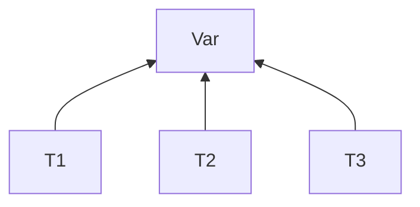

## Transazioni
**Eseguite in maniera atomica**

- RIduciamo tutte le struzioni a solo quelle di Read / Write

Var è condivisa, ma non vogliamo usare i semafori -> Transazioni atomiche concorrenti (con interleaving)

- ES. T1 e T2 volgiono accedere alla var A
	- Si alternano con le read write... ma come sapppiamo se A rimane consistente
	- Imponiamo la condizione che il risultato della loro esecuzione alternata, corrisponda  al risultato di *eseguire prima tutta una T e poi l'altra*(\*)
		- (*)**Sequenzalizzazione delle istruzione** 

> Esecuzione, prima T1 e poi T2
![[Pasted image 20211026113030.png]]

> Esecuzione T1 e T2 con interleaving equivalente a T1 - T2
![[Pasted image 20211026113543.png]]

Non in tutti i casi, l'esecuzione con interleaving porta ad una soluzione accettabile (rimando a T1 e T2, se seguo subito entrame le read(A) e poi le write(A), mi ritorvo con A=5 e non A=7)

## Protocolli di esecuzione
### Regole di comportamento
L'obbiettivo è quello di mantenere consistenti i dati
- Ci possono essere delle operazioni conflittuali:
	1. appartengono a Processi diversi
	2. usano la stessa variabile condivisa
	3. almeno una è una write  

#### Protocollo basato su TimeStamp
Quando T viene cerata, le viene assegnata un TimeStamp ( una marcatura temporale ) -> TS(T1),TS(T2) ...

- L'interleaving deve garantire che il risultato dell'esecuzione, sia equivalente alla sequelizzazione per ordine crecente dei TimeStamp

D: dato condiviso
R(D): timestamp più alto di una trans. che ha letto
W(D):  timestamp più alto di una trans. che ha scritto

**Protocollo**
- T vuole Read(D):
	1.a TS(T) < W(D) T abort -> Disfare i passi di T già eseguiti
	1.b Altrimenti, si esegue la lettura -> si aggiornano i TimeStamp R(D) = MAX(R(D),TS(T))
	
Tutto ciò appesantisce l'esecuzione, ma conpensa la mancanza di meccanismi di mutua esclusione

- T vuole Write(D):
    2.a TS(T) < R(D)  T Abort
	2.b TS(T) < W(D) T Abort
	2.c write consensita  -> aggiorno TimeStamp W(D) = TS(T)
	
Le T abortite vengono riavviate con un TS(T) nuovo (più alto)

### Prptocollo a 2 fasi -> Lock
1. fase di aquisizione dei lock (fase di crescita)
2. utilizzo dato
3. Fase di decresita (rilascio i lock)

Strategia che soffre spesso di Deadlock

# Deadlock
Solo le risorse condivise in mutua escluisione possono portare al DeadLock

Cuochi/Processi -> C1 C2 C3
Risorse condivise -> Olio 1 / aceto 1 / sale 1

C1 prende sale / C2 prende olio / C3 prende aceto ...
- Se devono prender 1 risorsa alla volta, tutto funziona.
- Se servono tutte le risorse insieme, si bloccano perchè ognuno deve rpendere una risorsa in possesso di qualcun altro -> **DeadLock**

### Condizioni necessarie al Deadlock
1. mutua esclusione
2. Possesso e attesa
1. Attesa Circolare
2. Assenza di prelazione

Non si verifica a tutte le esecuzioni. Il codice è corretto, ma poi dipende dalla sincronizzazione dei processi durante la singola esecuzione