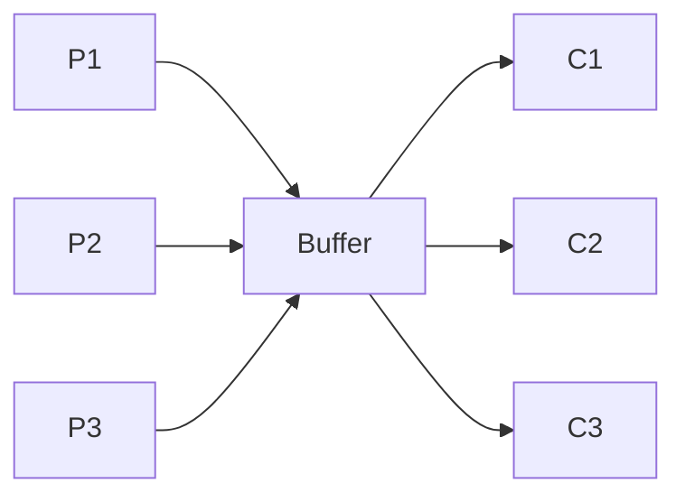
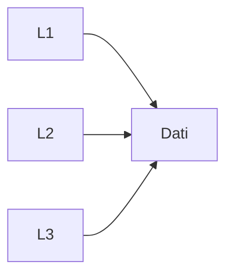

## Sincronizzazione
### Problemi Classici di sincronizzazione
1. problmema dei produttori-consumatori
2. problema dei lettori-scrittori
3. problema 5 filosofi


#### Produttori-Consumatori
Devono scambiare dati, utilizzando un buffer di capienza limitata

Pi -> produttore generico, inserisce dati nel buffer
- sospeso se il buffer è pieno

Cj -> consumatore generico, estrare dato dal buffer
- sospeso se buffer è vuoto

**Soluzione**
- Semaforo Mutex  di mutua-esclusione
- Semaforo conatore Libere
- Semaforo constatore Occupate

Sem Mutex inizializzato a 1;
Sem Libere inizializzato alla dimensione del buffer (N);
Sem Occupate inizializzato a 0;

**Produttore**:
```C
forever{
Produzione.elemento();
P(Libere); 			        <- blocca se non ci sono celle libere
P(Mutex);  				    <- garantisce mutua esclusione
<<S.C.|prduci.elem()>>;
V(Mutex);
V(Occupate);
}
```
**Grafico**

**Consumatore**
```C
fprever{
P(Occupare);			<- blocca se non ci sono celle occupate
P(Mutex);				<- garantisce mutua esclusione
<<S.C.|estrai.elem()>>;
V(Mutex);
V(Libere);
}
```

#### Lettori-Scrittori
1. Non ci sono limiti di spazio
2. I lettori non consumano il dato

**Mutua esclusione**, imposta solo agli scrittori

- i lettori possono leggere insieme
	- Appena arriva uno scrittore, si devono fermare tutti 

**Soluzione**
- Semafono Mutex = 1;  --> Di mutua esclusione
- Semaforo Scrittura = 1;  --> Di mutua esclusione
- int numLettori = 0 --> vrb. condivisa

**Scrittore**
```C
fprever{
	P(Scrittura);
	<<S.C.|scrivi.elem()>>;
	V(Scrittura);
}
```
**Lettore**
```C
fprever{
	P(Mutex);         <-- controlla accesso a variabile numLettori
	numLettori++;
	if(numLettori==1)  --> il lettre è solo
		P(Scrittura);
	V(Mutex);
	<<Legge()>>;
	P(Mutex);
	numLettori--;
	if(numLettori ==0) --> se era l'ultimo lettore
		V(Scrittura);
	V(Mutex);
}
```

#### 5 Filosofi
- 5 filosofi (i processi)
- per mangare hanno bisogno delle posate (accesso alle risorse condivise)
- le posate sono condivise per coppie (P2 sono utilizzabili da F2 e F3, P3 da F3 e F4)
	- quindi sono da prendere in Mutua sclusione 2 a 2

Possono generarsi situazioni di:
- Deadlock (bloccati in attesa di un evento, che può generare solo un altro  processo, bloccato anch'esso)
-  Sarvation 
-  Livelock

```C
forever{
	<<pensa>>
	
	<<mangia>>
}
```