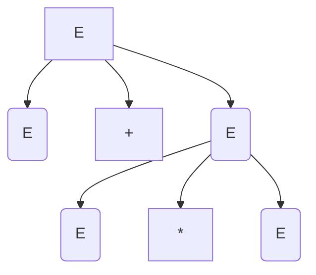
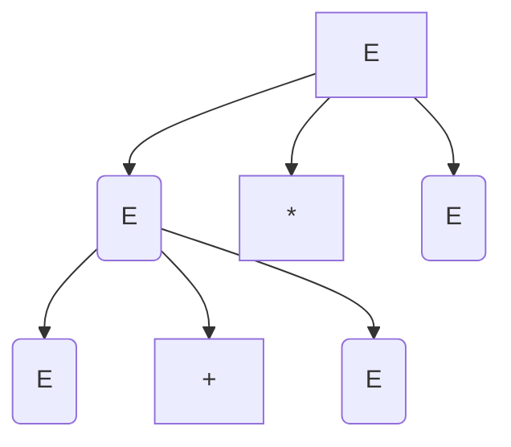

## Ambiguità delle espressioni in forma fissa
### precedenza degli operandi

1 + 2 \* 3

## Eliminazione delle ambiguità delle espresisoni
#### Strateriga
- si stratificano e sbilanciano le spressioni
- Espressione = somma di termini
- Termioni = prodotto di fattori
- Fattore = costante o epsressione tra parentensi

**Modifico la grammatica**
$$(\{E,T,F\},\{0,1,2...,9,+,*,(,)\},P,E)$$
Dove P è l'insieme delle seguenti produzioni
- E -> T | E + T
- T -> F | T \* F
- F -> 0 | 1 | ... | 9 | (E)

### Un linguaggio inerentemente ambiguo
- non essite alcuna gramatica non ambigua che generi il linguaggio
- $$L=\{a^nb^nc^md^m| n \geq 1,m\geq 1 \} \cup \{a^nb^mc^md^c|x\geq1,m\geq1\}$$
- Pertanto L si edinisdce **Inerentemente ambiguo**

**intuizione**
- In ogni grammatica che genera $L$ ci sono semrpe 2 derivbazioni canoniche distinte che generano una stringa della forma $a^nb^nc^nd^n$