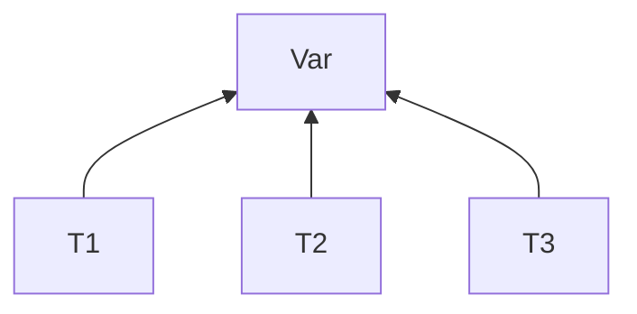

## Transazioni
**Eseguite in maniera atomica**

- RIduciamo tutte le struzioni a solo quelle di Read / Write

Var è condivisa, ma non vogliamo usare i semafori -> Transazioni atomiche concorrenti (con interleaving)

- ES. T1 e T2 volgiono accedere alla var A
	- Si alternano con le read write... ma come sapppiamo se A rimane consistente
	- Imponiamo la condizione che il risultato della loro esecuzione alternata, corrisponda  al risultato di *eseguire prima tutta una T e poi l'altra*(\*)
		- (*)**Sequenzalizzazione delle istruzione** 

> Esecuzione, prima T1 e poi T2
![[Pasted image 20211026113030.png]]

> Esecuzione T1 e T2 con interleaving equivalente a T1 - T2
![[Pasted image 20211026113543.png]]

## Protocolli di esecuzione
### Regole di comportamento
- l'obbiettivo è quello di mantenere consistenti i dati
	- Ci possono essere delle operazioni conflittuali:
		1. appartengono a Processi diversi
		2. usano la stessa variabile condivisa
		3. almemo una è una write  