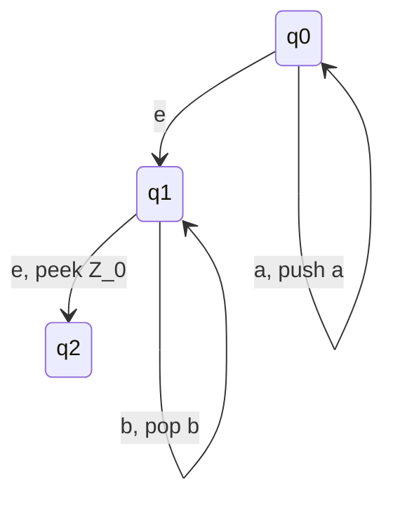
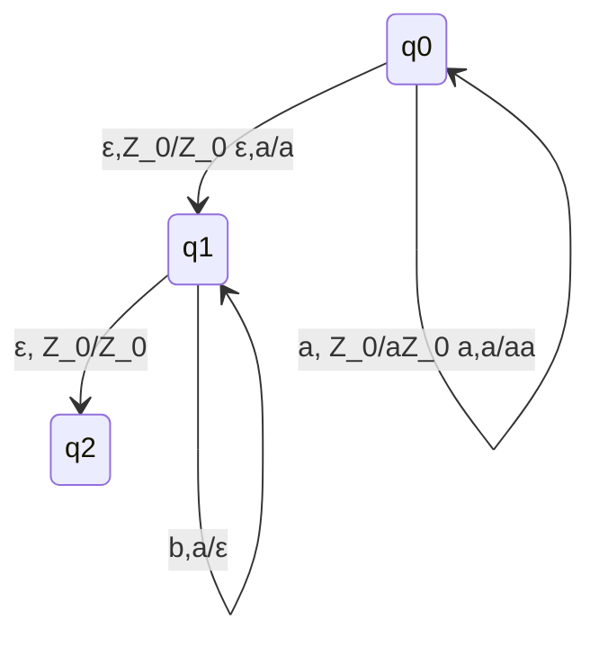

## Automi a pila

###  Esempio informale

**Inizializzazione**
La pla contiene il solo elemento $Z_0$ usato come "sentinella" (la pila finisce qui)

**Stato $q_0$: cojnteggio a**
- Accumulo le a sulla pila
- L'automa può "scommettere" di avert letto tutte le a e pèassa a $q_1$

**stato $q_1$: conteggio b**
- L'automa controlla ceh per ogni b, ci sia una a sulla pila, e la rimuove
- Se vede $Z_0$ sulla pila, vuol dre che ha raggiunto la fine e deve passare a q2

**Stato $q_2$: accettazione**

### Definizione
Un autokma a pila (PDA) è una settupla $A = (Q,\sum,\Gamma,\delta,q_0,Z_0,F)$ dovre:
- Q è insieme finito di stasti
- $\sum$ è l'alfabeto di input
- $\Gamma$ è l'alfabeto della pila (simboli memorizzabili)
- $\delta: Q x (\sum \cup \{\epsilon\}x\Gamma)$ -> $\wp(Qx\Gamma^*)$ è la funzione di transizione
- $q_0 \in Q$ è lo stato iniziona
- $Z_0 \in \Gamma$ è il simbolo iniziale presente nella pila
- $F ⊆ Q$ è l'insieme di stati finiti

**Interpretazione di $(p,\gamma) \in \delta(q,\alpha,Z)$**
Quando l'automa si trova nell ostato q e il simbolo in cima alla pila è Z

#### Esempio: riconosciumeto stringhe $a^nb^n$

- a, $Z_0$/$aZ_0$ -> se il prossimo elemento è a, e nella pila ho $Z_0$, posso sostituire $Z_0$ con a$Z_$0$ (è un push di a in cima alla pila)
- a,a/aa -> ragionamento simile, se vedo a in cima alla pila e ne pusho un altra, ottenog aa
- :ε,$Z_0$/$Z_0$ ε,a/a -> transizioni spontanee 
	- se simbolo in cima alla pila = $Z_0$, lo rimpiazzo con $Z_0$... (praticamente la lascio invariata)
	-  se simbolo in cima alla pila = a, lo rimpiazzo con a... (praticamente la lascio invariata)

