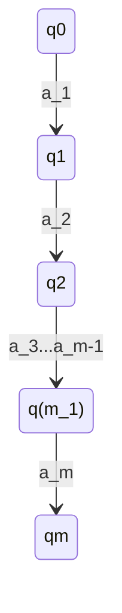

## Pumpling lemma per linguaggi regolari

### Teorema
_per ogni_ linguaggio regolare L _esiste_ $n \in N$ t.c., _per ogni_ $w \in L$ con $|w| \geq n$, _esistono_ x,y e z t.c. $w = xyz$

1. $y \neq \epsilon$
2. $|xy| \leq n$
3. $xy^kz \in L$ per ogni $K \geq 0$

![[Pasted image 20211012100918.png]]

### Esempio: $a^kb^k$ non è regolare
dimostrare che $L = \{a^kb^k | k \geq 0\}$ non è regolare facendo vedere che per L il pumpling lemma non vale
- un ipotetico automa, per verificare questo linguaggio, deve saper contare un nuimero indeterminato di a, e poi verificare che ci sia lo stesso numero di b
#### Dimostrazione
1. Supponiamo che esista n con le proprietà del puimpling lemma
1. Considero la stringa $w = a^nb^n$ che è in L e ha la proprietà $|w| = 2n \geq n$
1. Devono esistere x,y e z t.c. $w = xyz$ e che soddisfano le condizionni 1-3 del lemma
2. (finire da slide)

## Dimostraizone lemma
Sia L un linguaggio regolare:
DUnque esiste un DFA t.c. L = L(A)
Poniamo n = |Q|, ovvero n è il nuemro di stati di un DFA che riconosce L
Premdinao $w \in L$ t.c. $|w| \geq n$deve essere $w = a_1a_2...a_m$ con $m \meq n$
Se rappresentioamo oil cammino fatto da A per risocnoscere 2 come segue:

notiamo che questo cammino passa attraverso m +1 stati
> finire  slide precendente e copiare questa
![[Pasted image 20211012103955 1.png]]

Ora definiamo le tringhe x,y e z come segue
- $x =a_1a_2...a_i$
- $y=a_{i+1}...a_j$
- $z=a_{j+1}...a_m$

notiamo che:
1. $y \neq \epsilon$ in qunaot i < j dunque in y c'è almeno un simbolo
2. |xy| $\leq$ n in uqaot $q_i = q_j$ è il primo sdtato che si ripete e quindi gli stati da $q_0$ a $q_j$ sono al masismo n +1 attraversati leggendo al masismo n simboli su w
3. $xy^kz \in L$ per ogni $k \geq 0$ in quanrto tutti i cammini etichettati con $xy^kz$ portano l'automa da $q_0 \ a \ q_m$

![[Pasted image 20211012105001 1.png]]