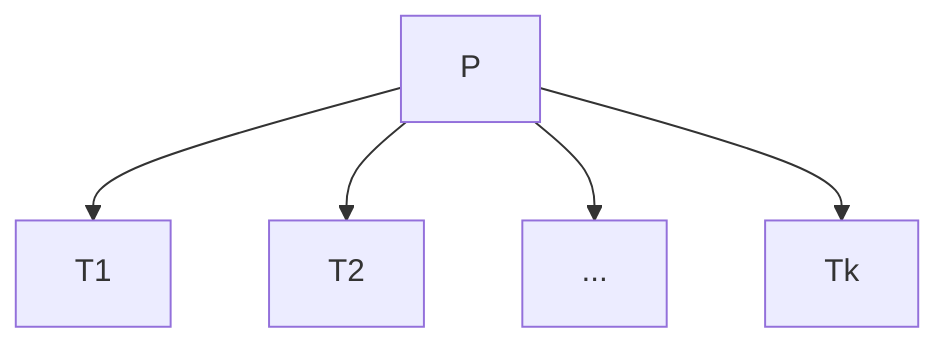

## Thread
- Sono interni ai processi
- Divisi in Utente (quando sono gestiti dai processi, all'interno dei processi) e Kernel (è un po' più trasparente al SO e vede la struttura del processo)

- lo scheduling dei Thread, se svolto all'interno del processo, può adattarsi a situaizoni diverse, sfruttando meccanismi diversi (in base al processo)
- Il content switch tra thread interni è un po' più veloce
- Se un thread Utente deve ricevere input/ produrre output / sincronizarsi per un messaggio, si blocca l'esecuzione ti tutto il processo
	- l'SO non vede i thread, quindi manda in waiting l'intero processo 
- Con i thread a livello Kernel, l'OS può assegnare la cpu ai singoli thread
	- Quindi può mettere in waiting i singoli thread, lasciando proseguire l'esecuzione degli altri threads

### Scheduing Thread:
1. 1 - 1 -> per ogni thread utente, assegno un unità di computazione (il SO vede tutti ithread di tutti i processi)
	- le unità di computazione si chiamano Thread kernel
1.   # Reucperare lezione TUTTA

