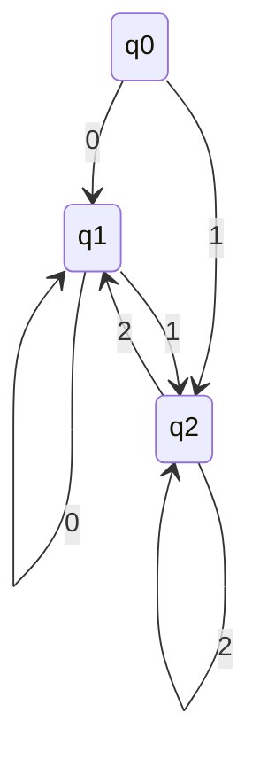

### Esempio $a^k$ con k primo non è regolare
Dimostare che  $L = \{a^k |\ k \  primo \}$ non è regolare facendo vedere che per L il suo pumpling lemma non vale

Supponiamo per assurdo che esista n con le proprietà enunciate nel pumpling lemma

Consideriamo la stringa $w = a^p$ dove p è un numero primo $p \geq n +2$. Siamo sempre in grado di trovare p con questa proprità in quanto esistono infiniti numeri primi. inoltre, la tringa w è in L e ha la proprità $|w| \geq n$.

devono esistere x, y e z t.c. $w = xyz$ e che soddisfano le prop. 1-3

Definiamo $m = |y|$, da cui segue $|xz|=p-m$.
  - Dalle condizioni 1-2 sappiamo che $1 \leq m \leq n$ 
  - Dalla condizione 4 sappiramo $xy^{p-m}z \in L$.  Tutta vai:
  - $$ |xy^{p-m}z| = |xz| + (p-m)|y| = p -m+(p-m)m=(p-m)(m+1)$$

e ora concludiamo che $|xy^{p-m}z| **non è primo** in quanto:
- da $1 \leq m$ deduco $2 \leq m +1$ 
- da $m \leq n$ e $p \geq n+2$ deduco $p-m\geq 2$

# Minimizzazione di automi a stati finiti deterministici
Capire se un automa è ottimizzato ed in caso negativo, come ottimizzarlo

### Sommario 

- osserviamo che c'è una ridondanza
- una stringa è accettata quando parte da q0 è accettata anche partendo da q2
- possiamo "fondere" q0 e q2 senza alterare il linguaggio riconosciuto dall'automa

#### Problema
- è desiderabile lavorare con DFA "piccoli"
- Avendo a disposizione un DFA, è possibile

-- ( finisre slide)

## Stati (in)distinguibili

### Def
Dato DFA a, diciamo che $p,q \in Q$ sono *indistinguibili* se

$$\hat\delta(p,w) \in F$$ <=> $$\hat\delta(q,w) \in F$$
per ogni $w \in $\sum^\*$
**Nota**
Affinche p e q siano distinguibili non è necessario che $\hat\delta(p,w)$ e $\hat\delta(q,w)$ siano lo stesso stato per ogni w, ma solo che siano entrambi non finali o finali per ogni w

### Def
Diciamo che 2 stati $q,p \in Q$ sono distinguibili se esiste $w \in \sum^\*$ t.c. sono una tra $\hat\delta(p,w)$ e $\hat\delta(q,w)$ appartiene a F.
Diaciamo che una stringa w con questa proprietà distinguq p da q

**NOTA**
In generale ci possono essere molte stringhe che distinguono 2 stati

### Esempio

- la tringa $\epsilon$ distingue q0 e q1, in qunaot q1 è finale mentre q0 no
- per lo stesso motivo, la stringa $\epsilon$ distingue q1 e q2
- q0 e q2 sono indistinguibili
	- sono entrambi non finale -> $\epsilon$ non li distingue
	- la tringa 0 non li distingue, poichè li porta entrambi a q1 
	- la tringa 1 non li distingue, poichè li porta entrambi a q2
	- dopo uno 0 o un 1, q0 e q2 confluiscono nello stesso stato e da lì in avanti il loro percorso è lo stesso. -> non può esistere una stringa che li distingua

## Algoritmo per trovare stati distinguibili
- prenod in input un DFA A e restituisco l'insieme di tutte e sole le coppie di stati distinguibili di A

### Algoritmo
1. all'inizio marchio nessuna coppia è marchiata come distinguibili
2. Si marcano le coppie {p,q} in cui $p \in F$ e $q \nin F$
3. Se sistono $p,q \in Q$ e $ a \in \sum$ t.c. {$\delta$(p,a),$\delta$(q,a)} è marcata come distinguibile, si marca anche {p,q} come distinguibile
4. Si ripete il passo 3 finchè non vengono a mancare nuove coppie distinguibili

### Esecuzione algoritmo
- tabella triangolare -> le righe sono etichettare con gli stati dal secondo all'ultimo e le cui colonne sono etichettare con gli stati dal primo al penultimo
- si marchiano le caselle di delle coppie distinguibili
- itero il passo 3

![[Pasted image 20211013123756.png]]

![[Pasted image 20211013125750.png]]